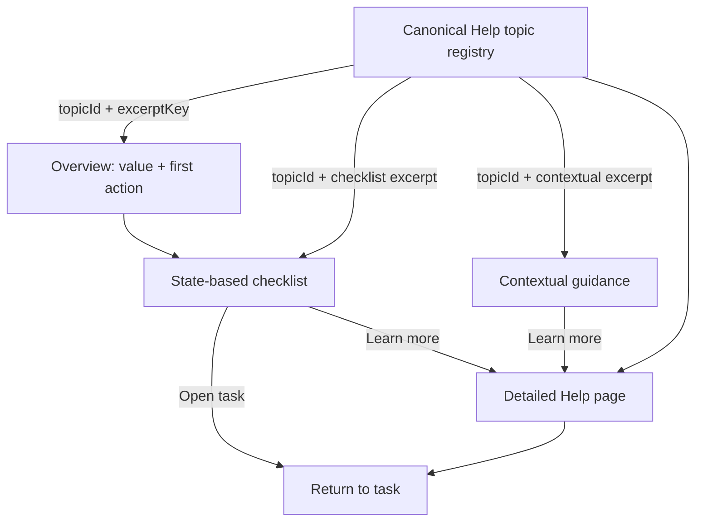

# Design Package: CGP-GUIDE-001 — Hợp nhất onboarding theo ngữ cảnh và Help

Version: 1.0 — Design review candidate  
Date: 2026-07-11  
Owner: UI/UX Designer  
Approval status: APPROVED — xem `po-ba-design-decision.md`  
Scope represented: Phase 0 + Phase 1 complete; Phase 2 specified but gated by eligibility; Phase 3 excluded.

## 1. Brief interpretation

### Product problem

Ba lớp hướng dẫn hiện tại tự sở hữu nội dung và trạng thái: `OnboardingModal`,
`TreeWorkspaceTour` và `HELP_TOPICS`. Người mới chưa có đường đi rõ từ lần đầu vào sản phẩm tới
first value; người đã quen có thể bị hướng dẫn lặp; copy chứa jargon và một số claim không phản ánh
active Next.js runtime.

### Target users

- Primary: người lần đầu dùng; người lớn tuổi; người ít rành công nghệ.
- Secondary: người quay lại cần tra cứu; owner/collaborator/linked user; người thành thạo muốn skip.

### Desired outcome

- Luôn có một bước hữu ích tiếp theo nhưng không chặn tác vụ.
- Checklist hoàn thành bằng outcome thật, không bằng việc mở hướng dẫn.
- Guidance đúng role/state và đi sâu vào một Help topic có stable ID.
- Help là canonical content source duy nhất.
- Skip, dismiss, complete, reopen và content-version update có hành vi thống nhất.

### In scope

- Canonical Help architecture, overview, checklist, contextual guidance và deep links.
- Trigger, recurrence, version, dismiss, reopen, accessibility, responsive và privacy-safe metrics.
- Production/prototype sync cho tree list, tree populated/empty và Help.

### Non-goals

- Không chatbot, video, CMS, đa ngôn ngữ hoặc gamification.
- Không redesign auth, navigation, graph hoặc toàn bộ visual language của Help.
- Không thay đổi permission, privacy, kinship, API hay business rules.

### Confirmed constraints

- Active runtime: Next.js full-stack; password/Google là active auth.
- Password recovery không được quảng bá.
- Standard ``; prototype chỉ dùng dữ liệu hư cấu.
- Target 48×48px, không dưới 44×44px; keyboard; screen reader; 200% reflow; reduced motion.
- Region Bắc/Trung/Nam điều chỉnh cách xưng hô, không phải language selector.

### Assumptions used for this design

- Guidance state is defined independently of storage implementation.
- A role/category and coarse product state may be evaluated without recording family content.
- Browser history can provide `Quay lại việc đang làm` without putting tree/person IDs into guidance telemetry.
- The existing Help route and in-app Help entry point remain available.

### Questions requiring PO/BA

1. Phase 1 guide state đồng bộ đa thiết bị hay chỉ trên thiết bị hiện tại?
2. Event/reminder và person-node claiming có tiếp tục excluded cho tới một approval riêng không?
3. Analytics provider và retention period nào được phép dùng?
4. Có chấp thuận cadence review nội dung mỗi quý và tại mọi feature release không?
5. Có chấp thuận role variants của checklist tại mục 5 không?

## 2. Current experience audit

### Current flow and ownership

| Layer | Trigger/state | Content owner in code | Persistence | Reopen | Main issue |
|---|---|---|---|---|---|
| Onboarding modal | Tự mở ở `/tree` nếu chưa có cookie | Mảng 4 bước trong `OnboardingModal` | `tutorial_dismissed=true`, 365 ngày | Không có entry point production đáng tin cậy | Dismiss = complete; overview dạy quá nhiều; quảng bá reminders |
| Workspace tour | Tự mở khi vào populated tree | Mảng 5 bước + CSS selectors trong `TreeWorkspaceTour` | `tree_workspace_tour_seen_v1=true` | `SettingsModal` có hook nhưng production không truyền callback | Dismiss = complete; selector fragile; target thiếu thì tooltip giữa màn hình với copy cũ |
| Help | Link `/help`, mục lục 9 topic | `HELP_TOPICS` | Không cần | Có | Jargon, đoạn dài, role/prerequisite/recovery chưa có cấu trúc |

### Duplication and contradictions

| Concept | Modal | Tour | Help | Finding / decision |
|---|---|---|---|---|
| Pan/zoom | Có | Có | `tim-duong-di` | Trùng ba cách diễn đạt. Canonical: `dieu-huong-so-do` |
| Add person/relationship | Có | Gộp với collaboration | `them-nguoi-than` | Tách first person và primitive/dashed relationship theo dependency |
| Search | Không | Có | `tim-duong-di` | Search và path analysis đang gộp sai mục đích. Tách `tim-kiem-thanh-vien` |
| Viewpoint/address | Không | Có | Hai topic có jargon | Canonical: `doi-diem-nhin` + `xem-cach-xung-ho`, copy đời thường |
| Collaboration | Không | Gộp với add | Có claim vượt UI removal | Phase 2, role-aware; không nói collaborator removal |
| Events/reminders | Modal quảng bá | Không | Không | Excluded tới PO/BA runtime approval |
| Solid/dashed | Không | Không | Có jargon kỹ thuật | Dùng “quan hệ rõ đường nối (nét liền)” và “quan hệ khai báo (nét đứt)” |
| Privacy | Không | Không | Có claim tuyệt đối | Phase 2; mô tả chính xác theo role và setting, bỏ “tối đa” |
| Claim vs collaboration code | Không | Không | Dễ trộn | Claim conditional; collaboration active; tách topic và copy |

### Evidence-backed usability findings

- Tour auto-opens over a dense graph workspace and uses a spotlight/tooltip before user intent is known.
- Mobile tour card fits, but competes with the bottom toolbar and depends on geometry of relocated controls.
- Help is readable but long; every topic is expanded, so direct task retrieval requires scanning.
- Empty tree already has a strong primary form. A second floating checklist would compete with the first action.
- Existing right info rail has a natural idle state for a compact checklist on populated tree.
- Current prototype/help tests validate presence and anchors, not excerpt traceability, eligibility or return-to-task.

### Current runtime eligibility

| Status | Capabilities |
|---|---|
| Phase 1 allowed | Create/open tree; first person; primitive relationship; select person/address; viewpoint; pan/zoom; legend; search; Help; text scaling |
| Phase 2 allowed after Phase 1 | Asserted relationship; region; privacy/redaction/field visibility/sharing; photos JPEG/PNG; collaboration active roles; deletion |
| Conditional/excluded | Event/reminder; person-node claim; display-name account editing until separately verified |
| Prohibited | Password recovery; push/email/Zalo promises; RSVP/host rotation/calendar; advanced roles; import/export; all roadmap-only features |

## 3. Guidance architecture



### Layer responsibilities

1. **Overview** — one non-modal, inline orientation block on `/tree`; value, next action, skip.
2. **Checklist** — no more than five eligible core items; real outcome signals; collapsible.
3. **Contextual guidance** — one short goal at a time, only after stable eligible context.
4. **Help** — full self-contained instructions, prerequisites, role, recovery and privacy notes.

### Canonical Help content model

Every topic is one canonical record:

```text
HelpTopic {
  id: stable kebab-case ID
  version: integer changed only for material meaning/eligibility changes
  title: Vietnamese sentence case
  summary: one sentence
  status: active | conditional | excluded
  roles: owner | collaborator | linked-user | reader | all
  purpose: user outcome
  prerequisites: ordered list
  steps: ordered list
  success: observable outcome
  recovery: error/disabled/offline/permission paths
  privacyNote?: precise disclosure
  excerpts: { overview?, checklist?, contextual? }
  relatedTopicIds: stable IDs
  contentOwner: PO/BA + Design
  runtimeEvidence: UI/API verification reference
  reviewedAt: date
}
```

Rules:

- Components receive `topicId` + `excerptKey`; no raw explanatory copy at call sites.
- Excerpt text is stored inside the canonical topic, not duplicated in tour/checklist arrays.
- Stable IDs never change for copy edits. A concept split creates new IDs and redirect aliases.
- Conditional/excluded topics cannot produce overview/checklist/contextual excerpts.
- PO/BA approves scope/eligibility; Designer owns clarity/hierarchy; engineering supplies runtime evidence and regression tests.
- Review at every relevant feature release and at least quarterly if PO/BA approves the cadence.

### Proposed stable topic catalogue

| ID | Title | Phase/status |
|---|---|---|
| `bat-dau` | Bắt đầu với Cây Gia Phả | Phase 1 active |
| `tao-hoac-mo-cay` | Tạo hoặc mở cây gia phả | Phase 1 active |
| `them-nguoi-dau-tien` | Thêm người đầu tiên | Phase 1 active |
| `them-quan-he-ro-rang` | Thêm cha, mẹ, vợ/chồng hoặc con | Phase 1 active |
| `xem-thong-tin-va-xung-ho` | Xem thông tin và cách xưng hô | Phase 1 active |
| `doi-diem-nhin` | Đổi điểm nhìn | Phase 1 active |
| `dieu-huong-so-do` | Di chuyển trên sơ đồ | Phase 1 active |
| `tim-kiem-thanh-vien` | Tìm người trong cây | Phase 1 active |
| `doc-chu-giai-so-do` | Hiểu đường nối và trạng thái | Phase 1 active |
| `quan-he-khai-bao` | Khi chưa biết đầy đủ đường quan hệ | Phase 2 active after rollout |
| `chon-vung-mien` | Chọn vùng dùng để tính cách xưng hô | Phase 2 |
| `bao-ve-nguoi-con-song` | Bảo vệ thông tin người còn sống | Phase 2 |
| `quyen-hien-thi-truong` | Chọn ai được xem từng thông tin | Phase 2 |
| `chia-se-cay` | Chia sẻ quyền xem cây | Phase 2 |
| `quan-ly-anh` | Thêm và quản lý ảnh | Phase 2 |
| `xoa-nguoi-trong-cay` | Xóa một người khỏi cây | Phase 2 |
| `moi-cong-tac-vien` | Mời người cùng cập nhật cây | Phase 2 owner |
| `tham-gia-cong-tac` | Tham gia bằng mã mời | Phase 2 eligible user |
| `tai-khoan-va-nguoi-trong-cay` | Tài khoản và người trong cây khác nhau thế nào | Phase 2 |
| `xac-nhan-nguoi-trong-cay` | Xác nhận người trong cây | Conditional; unpublished |
| `tuy-chinh-hien-thi` | Cỡ chữ, giao diện và chuyển động | Phase 1 active |
| `dieu-khien-huong-dan` | Bỏ qua và xem lại hướng dẫn | Phase 1 active |

## 4. Proposed user flows

### First eligible visit

1. User enters `/tree`; normal page remains usable.
2. Inline overview/checklist card is expanded below page header.
3. Heading: `Bắt đầu theo cách của bạn`; primary task is based on current product state.
4. User may start the task, collapse, choose `Để sau`, or open Help.
5. Completing a real outcome updates the item and reveals the next eligible item without opening a modal.
6. On entering a populated workspace, no automatic linear tour starts.
7. One contextual tip may appear only after layout is stable and no blocking surface is open.

### Returning visit with incomplete checklist

1. Checklist returns collapsed with `Bước tiếp theo: …`.
2. It expands only on user action; no overview replay.
3. A dismissed contextual tip does not repeat for the same topic version.

### Skip/dismiss

- `Để sau`: collapse checklist for the current visit; retain real completion state.
- `Ẩn hướng dẫn bắt đầu`: suppress automatic checklist expansion for the current guide version.
- Closing a contextual tip marks only that topic/version dismissed, never complete.
- No dismissal changes product data or counts as a checklist outcome.

### Completion

1. Last eligible item completes from product/UI outcome.
2. Checklist announces `Bạn đã hoàn thành các bước bắt đầu.` in a polite live region.
3. Card remains collapsed and can be reopened; no confetti, streak or reward.

### Manual reopen

- Existing `Trợ giúp` entry remains canonical entry.
- Help header includes `Xem các bước bắt đầu` when signed in.
- Workspace idle rail and mobile toolbar expose `Hướng dẫn`/`Bước bắt đầu` entry.
- Reopen shows current status; it does not reset completed items.
- A separate secondary action `Xem lại mẹo` lets users replay contextual excerpts manually.

### New guide version/new eligible feature

- Material topic change increments only that topic version.
- A newly active phase-2 topic may show one `Có hướng dẫn mới` notice only when role/state eligible.
- It never resets core checklist or reopens overview automatically.

### Help deep link and return-to-task

1. Checklist/tip opens `/help#<topic-id>`.
2. Target heading receives focus after navigation; screen reader announces title.
3. Help shows `Quay lại việc đang làm` only when a safe same-app history entry exists.
4. Return uses browser history; guidance telemetry never records the tree/person URL.
5. Direct external visit has `Quay lại danh sách cây` instead.

## 5. First-value checklist

### Item catalogue and completion logic

| Order | Checklist ID | Label | Eligibility | Real completion signal | Opens |
|---:|---|---|---|---|---|
| 1 | `core-tree-open` | Tạo hoặc mở một cây | Signed-in; all roles | Current user has entered an authorized tree; creating/opening Help does not count | `/tree` create/open action; Help `tao-hoac-mo-cay` |
| 2 | `core-first-person` | Thêm người đầu tiên | Empty tree; `canEdit` | Authorized tree person count changes from 0 to at least 1 after successful response | Empty-tree form; Help `them-nguoi-dau-tien` |
| 3 | `core-first-primitive` | Nối một quan hệ cha, mẹ, vợ/chồng hoặc con | `canEdit`; at least 1 person; no primitive edge | Primitive relationship count becomes at least 1 after success | Add relationship; Help `them-quan-he-ro-rang` |
| 4 | `core-inspect-address` | Chọn một người và xem cách xưng hô | Populated readable tree | A person is selected and address state resolves to a defined or explicit `chưa xác định` result | Select node; Help `xem-thong-tin-va-xung-ho` |
| 5 | `core-viewpoint` | Thử đổi điểm nhìn | At least 2 readable people | A different eligible viewpoint is selected and refreshed address state finishes | Viewpoint control; Help `doi-diem-nhin` |

### Role variants

- **Owner, no tree:** all eligible items in dependency order.
- **Owner, empty tree:** item 1 is complete; show items 2–5 as they become eligible.
- **Collaborator with edit permission:** item 1 complete; items 2/3 only if current tree state needs them; then 4/5.
- **Linked user or reader/non-editor:** never show create/edit items. Show `Mở cây`, `Chọn một người`, `Đổi điểm nhìn` when allowed.
- **Permission denied:** no checklist; show uniform recovery to tree list/Help without revealing hidden actions.

### Checklist behavior

- Maximum five core items; only eligible items appear.
- Dependency-locked items are hidden, not shown as disabled homework.
- Progress text is descriptive (`2 trong 4 bước đã xong`), not points/badges.
- Product state is authoritative. Guidance booleans may remember UI outcomes such as a successful viewpoint refresh, but store no IDs or content.
- Dismissed, completed and current guide version are separate states.

## 6. Contextual guidance specification

### Trigger table

| Guidance ID / topic | Trigger | Role/state gate | Frequency | Target/fallback |
|---|---|---|---|---|
| `tip-graph-nav` / `dieu-huong-so-do` | First stable populated workspace | Any reader | Auto once/version | Graph canvas; fallback inline card, no spotlight |
| `tip-select-person` / `xem-thong-tin-va-xung-ho` | User has not selected a person after first interaction | Any reader | Once/version | Canvas node region; mobile bottom sheet |
| `tip-viewpoint` / `doi-diem-nhin` | First address panel viewed | At least 2 readable people | Once/version | Visible viewpoint control; fallback inline with `Tìm hiểu thêm` |
| `tip-relationship-mode` / `them-quan-he-ro-rang` | User opens Add relationship first time | `canEdit` | Once/version | Inside form, immediately before mode choice; never overlay |
| `tip-legend` / `doc-chu-giai-so-do` | User opens legend first time | Any reader | User-initiated only | Inside legend header/body |
| `tip-region` / `chon-vung-mien` | Owner opens tree settings | Owner only | Once/version, Phase 2 | Inline helper next to region |
| `tip-privacy` / `bao-ve-nguoi-con-song` | Privacy setting first receives focus | Owner or permitted linked user as applicable | Once/version, Phase 2 | Inline helper; never show hidden controls |
| `tip-collaboration` / role-specific topic | Collaboration modal opens | Owner vs invitee | Once/version, Phase 2 | Modal intro; copy selected by role |

### Recurrence and interruption rules

- At most one auto contextual tip per page visit.
- Do not auto-show while a modal/form error/loading overlay/keyboard operation is active.
- Wait until layout is stable; do not chase targets during animation.
- Dismiss suppresses the same topic/version. Manual replay always works.
- A successful product action may complete a checklist item but does not automatically dismiss unrelated guidance.

### Target recovery algorithm

1. Resolve semantic target descriptor, not a single CSS selector.
2. If visible and enabled, anchor without covering it.
3. If relocated by breakpoint, use the visible variant.
4. If offscreen, do not auto-scroll. Present inline/bottom-sheet guidance with optional `Đưa tôi tới nút` only when the target remains eligible.
5. If disabled, attach to its container and explain the prerequisite.
6. If absent or role-ineligible, do not render the tip. Offer only the relevant Help topic from the checklist/Help.
7. Geometry failure removes spotlight/scrim; it never creates a floating orphan tooltip.

## 7. Information hierarchy and component specification

### `/tree` overview + checklist

- Position: below existing page header, above tree grid.
- Surface: existing paper card language; max content width follows page grid.
- Expanded hierarchy: eyebrow `Bắt đầu` → H2 → one-sentence value → next task → checklist → controls.
- Collapsed hierarchy: `Bước tiếp theo: <label>` + `Mở`.
- No modal or scrim. Create/open tree remains usable.

### Empty tree

- Keep existing first-person form as dominant action.
- Add one short canonical excerpt above the form; no separate checklist card.
- After successful person creation, transition to populated workspace and focus the checklist status, not a celebration overlay.

### Populated workspace

- Desktop: checklist card occupies existing idle info rail when no person is selected; selecting a person restores current info panel.
- Tablet: compact card overlays neither graph toolbar nor controls; use the existing info-panel region.
- Mobile: a 48×48 `Hướng dẫn` action opens a non-modal bottom sheet; sheet height is content-driven with internal scrolling.
- Contextual tips use anchored popover only on desktop/tablet with reliable target; mobile uses bottom sheet/inline helper.

### Help

- Preserve current page visual language.
- Add topic categories and task-oriented summaries; only one topic needs expansion on narrow screens if implementation chooses disclosure UI.
- Direct-linked topic is visibly marked and focused.
- Topic anatomy: outcome, who can do it, before you start, steps, success, problems/recovery, privacy, related topics.
- Provide `Quay lại việc đang làm` as described above.

## 8. State matrix

| State | Required | Designed | Behavior |
|---|---:|---:|---|
| Default | Yes | Yes | Inline/collapsed guidance without blocking product |
| First eligible visit | Yes | Yes | Expanded overview/checklist; no auto linear tour |
| Returning incomplete | Yes | Yes | Collapsed next-step summary |
| Completed | Yes | Yes | Polite completion message, then collapsed reusable state |
| Skipped/dismissed | Yes | Yes | Suppress auto surface for version; retain outcomes; reopen available |
| New version/feature | Yes | Yes | Topic-scoped notice once; no checklist reset |
| Loading | Yes | Yes | Guidance waits; skeleton/loading state remains primary |
| Empty/no tree | Yes | Yes | Tree-list next task; no unavailable workspace tips |
| Empty tree | Yes | Yes | First-person form remains dominant; inline excerpt only |
| Populated | Yes | Yes | Idle-rail checklist + contextual tips |
| Error/offline | Yes | Yes | Keep task state; `Thử lại` and Help recovery; never mark complete |
| Validation | Yes | Yes | Inline product error remains nearest; guidance pauses |
| Disabled target | Yes | Yes | Explain prerequisite in container; no spotlight |
| Success | Yes | Yes | Update outcome after confirmed product response/state |
| Destructive confirmation | Yes | Yes | No guidance overlay during deletion confirmation |
| Permission denied | Yes | Yes | Hide unauthorized actions/topics; uniform recovery |
| Privacy-redacted | Yes | Yes | Explain redaction without revealing hidden values |
| Target absent/offscreen/relocated | Yes | Yes | Semantic resolution → inline/bottom-sheet fallback |
| Help direct link | Yes | Yes | Focus topic heading; self-contained content |
| Return-to-task | Yes | Yes | Safe history back; fallback tree list |
| Mobile | Yes | Yes | Bottom sheet/inline, 48px controls, no hover |
| Tablet | Yes | Yes | Re-composed target resolution and info rail |
| Desktop | Yes | Yes | Inline checklist and anchored popovers when safe |

## 9. Responsive specification

### Desktop — 1280×800

- `/tree`: checklist spans available content column, not full viewport.
- Workspace idle rail: 320–360px preferred width; graph remains primary.
- Anchored popover: 320px preferred, 12px viewport margin, maximum 40rem text line length.
- Sidebar collapsed/expanded does not change topic or recurrence state; target resolution reruns after layout settles.

### Tablet — 768×1024

- Checklist uses full available content width.
- Workspace controls may relocate to second row; resolver selects visible variant.
- Popover may switch to centered inline card without scrim when safe anchoring is unavailable.

### Mobile — 375×667

- No floating spotlight tour.
- Guidance opens as bottom sheet/inline helper with 16px side margins, max-height `min(70dvh, content)`, internal scroll.
- Sticky sheet footer contains at most two actions: secondary `Để sau`, primary task/`Xong`.
- Sheet never covers the only primary product action; empty-tree helper stays above the form.

### 200% text scaling

- Popovers become normal-flow cards or bottom sheets.
- No fixed height for checklist/tip body.
- Actions wrap vertically; primary action remains last in focus and visual order.
- Progress dots are not used as the only step indicator.

### Reduced motion

- No spotlight pulse, carousel slide or animated target chase.
- State changes use immediate visibility or a short opacity change; information remains identical.

## 10. Accessibility specification

- Overview/checklist: `<section aria-labelledby>`; checklist is a semantic list; completed state includes visible text and icon, not color alone.
- Progress uses text plus `<progress>` only if it has an accessible label/value.
- Context tip: non-modal `role="dialog"` only when it contains actions and needs a named region; otherwise `role="note"`. Do not use `tooltip` for interactive content.
- Auto tip initial focus stays on the user's current control. Manually opened bottom sheet/dialog receives initial focus on heading or close button as appropriate.
- Escape closes popover/sheet and restores focus to opener. Modal focus trap is used only for a genuinely modal surface; phase-1 overview is not modal.
- Topic deep link moves focus to `h2[tabindex=-1]` after navigation.
- Dynamic checklist completion announces one concise message through `aria-live="polite"`; no repeated announcements on render.
- Every close/reopen/task action is at least 44×44px, target 48×48px.
- Touch/keyboard equivalents exist for every interaction; no hover-only copy or gesture-only instruction.
- Contrast follows existing semantic tokens. Guidance never relies only on terracotta/green to convey status.

## 11. Privacy-safe instrumentation

### Approved event taxonomy

| Event | Allowed fields |
|---|---|
| `guide_shown` | `guide_id`, `topic_id`, `surface`, `role_category`, `device_category`, `guide_version`, coarse app version/time |
| `guide_skipped` | Same categorical fields; `reason_category` optional from fixed enum |
| `guide_completed` | `guide_id`, `guide_version`, categorical context |
| `guide_reopened` | `guide_id`, `entry_surface`, categorical context |
| `guide_help_opened` | `topic_id`, `source_layer`, categorical context |
| `checklist_item_completed` | `checklist_id`, `guide_version`, `role_category`, `device_category` |
| `guide_returned_to_task` | `topic_id`, `return_result: success|fallback`; never the URL |

### Prohibited payloads

- User/account/tree/person identifiers, including hashes or pseudonymous stable IDs.
- Names, emails, phone numbers, dates, photos, relationship labels/types from user data.
- Search queries, free text, invite/claim codes, share tokens, URLs containing private IDs.
- Error bodies that may contain family data.

If no approved analytics infrastructure exists, emit no substitute console/server logs.

## 12. Final Vietnamese copy deck

### Overview/checklist

| Location / key | Final copy | Canonical topic |
|---|---|---|
| Overview eyebrow | Bắt đầu | `bat-dau` |
| Overview title | Bắt đầu theo cách của bạn | `bat-dau` |
| Overview helper | Làm từng bước khi thuận tiện. Bạn có thể để sau và mở lại bất cứ lúc nào. | `bat-dau` |
| Expand | Xem các bước | `dieu-khien-huong-dan` |
| Collapse | Thu gọn | `dieu-khien-huong-dan` |
| Dismiss | Để sau | `dieu-khien-huong-dan` |
| Hide version | Ẩn hướng dẫn bắt đầu | `dieu-khien-huong-dan` |
| Reopen | Xem lại hướng dẫn | `dieu-khien-huong-dan` |
| Completion | Bạn đã hoàn thành các bước bắt đầu. | `dieu-khien-huong-dan` |
| Learn more | Tìm hiểu thêm | Per-topic |
| Return | Quay lại việc đang làm | `dieu-khien-huong-dan` |
| Direct-link fallback | Quay lại danh sách cây | `tao-hoac-mo-cay` |

### Checklist items

| ID | Label | Helper/action |
|---|---|---|
| `core-tree-open` | Tạo hoặc mở một cây | Chọn nơi bạn muốn bắt đầu ghi lại gia đình. |
| `core-first-person` | Thêm người đầu tiên | Bắt đầu với chính bạn hoặc một người thân. |
| `core-first-primitive` | Nối một quan hệ gần | Thêm cha, mẹ, vợ/chồng hoặc con để hệ thống hiểu đường quan hệ. |
| `core-inspect-address` | Chọn một người để xem xưng hô | Mở thông tin của một người trên sơ đồ. |
| `core-viewpoint` | Thử đổi điểm nhìn | Xem cách xưng hô thay đổi khi nhìn từ một người khác. |

### Contextual and recovery copy

| Context | Final copy |
|---|---|
| Graph navigation | Kéo vùng trống để xem nhánh khác. Dùng các nút phóng to, thu nhỏ nếu thao tác bằng hai ngón chưa quen. |
| Select person | Chọn một người trên sơ đồ để xem thông tin và cách xưng hô. |
| Viewpoint | Điểm nhìn là người dùng để tính cách xưng hô. Đổi người ở đây để xem cây theo góc nhìn khác. |
| Primitive mode | Chọn cha, mẹ, vợ/chồng hoặc con khi bạn biết rõ đường quan hệ. Đường nối sẽ hiển thị bằng nét liền. |
| Asserted mode | Nếu chưa biết đủ người ở giữa, bạn có thể ghi cách gọi hiện tại. Đường nối nét đứt không được dùng để suy ra quan hệ với người khác. |
| Disabled viewpoint | Cần ít nhất hai người có thể xem trong cây để đổi điểm nhìn. |
| Missing target | Công cụ này chưa có trong trạng thái hiện tại. Bạn vẫn có thể đọc hướng dẫn chi tiết. |
| Offline | Chưa thể kiểm tra tiến độ lúc này. Hãy kết nối lại rồi thử lại; các bước đã hoàn thành vẫn được giữ. |
| API error | Chưa thể cập nhật bước này. Thao tác của bạn chưa được tính là hoàn thành. |
| Permission denied | Bạn không có quyền thực hiện thao tác này trong cây hiện tại. Các hướng dẫn chỉnh sửa đã được ẩn. |
| Privacy redacted | Một số thông tin người còn sống đang được ẩn theo quyền xem của bạn. Sơ đồ vẫn giữ vị trí của người đó. |
| Region | Vùng miền quyết định từ xưng hô được dùng trong cây. Đây không phải cài đặt ngôn ngữ. |
| Collaboration owner | Bạn có thể mời người khác cùng cập nhật cây và xem trạng thái lời mời. |
| Collaboration invitee | Nhập mã mời để gửi yêu cầu tham gia. Bạn có thể cần chờ chủ cây duyệt. |

### Terminology map

| Avoid in primary copy | Use |
|---|---|
| Derived_Relationship | quan hệ rõ đường nối / quan hệ nét liền |
| Asserted_Relationship | quan hệ khai báo / quan hệ nét đứt |
| Kinship_Resolver | hệ thống tính cách xưng hô |
| Form_Of_Address | cách xưng hô |
| birth order | thứ tự trong gia đình |
| Viewpoint | điểm nhìn; có thể ghi “điểm nhìn” trong ngoặc khi cần nối với label hiện tại |
| node | người trong cây |
| Claimed_Node | người trong cây đã được liên kết với tài khoản |
| Private/Public/Link | riêng tư / bằng liên kết / công khai cho người đã đăng nhập, theo đúng UI hiện hành |

## 13. Journey × layer × role/state coverage matrix

Legend: O = overview, C = checklist, X = contextual, H = Help, — = deliberately absent.

| # | Journey | Role/state | O | C | X | H | Completion / gate |
|---:|---|---|:---:|:---:|:---:|:---:|---|
| 1 | Active sign-in/sign-up → product | Anonymous/new | O | — | — | H | Session established; auth redesign excluded |
| 2 | Understand tree list; create/open tree | Signed-in | O | C | X | H | Authorized tree opened |
| 3 | First person | Editor, empty | — | C | X | H | Person count ≥1 after success |
| 4 | First primitive relationship | Editor | — | C | X | H | Primitive edge ≥1 after success |
| 5 | Open graph/select/address | Reader+ | — | C | X | H | Selected person + address state resolved |
| 6 | Change viewpoint | Reader+, ≥2 people | — | C | X | H | New viewpoint + address refresh finished |
| 7 | Pan/zoom/focus | Reader+, populated | — | — | X | H | User-initiated only; no stored completion |
| 8 | Add/edit person | Editor | — | — | X | H | Phase 2 except first person |
| 9 | Solid/dashed relationship | Editor | — | primitive only | X | H | Dashed guidance Phase 2; active evidence confirmed |
| 10 | Search/filter | Reader+, populated | — | — | X | H | Phase 1 basic search; advanced filters remain Help/context |
| 11 | Legend/node/edge states | Reader+ | — | — | X | H | User opens legend |
| 12 | Resolve conflict | Owner/editor | — | — | X | H | Phase 2; only if conflict UI active |
| 13 | Region | Owner | — | — | X | H | Phase 2; region saved |
| 14 | Living redaction/field visibility | Owner/eligible linked user | — | — | X | H | Phase 2; role-gated |
| 15 | Photos | Owner/linked user per current permission | — | — | X | H | Phase 2; JPEG/PNG only |
| 16 | Deletion strategies | Authorized editor per runtime | — | — | X | H | Phase 2; no guidance over confirmation |
| 17 | Account vs person/claim | All relevant roles | — | — | X | H | Claim portion conditional/unpublished |
| 18 | Owner invites collaborator | Owner | — | — | X | H | Phase 2; invite result/status shown |
| 19 | Invitee joins/waits | Signed-in invitee | — | — | X | H | Phase 2; active join/approval only |
| 20 | Collaboration vs claim code | Owner/invitee/linked | — | — | X | H | Phase 2; claim side conditional |
| 21 | Role understanding | Owner/collaborator/linked/reader | — | — | X | H | Copy selected by actual role |
| 22 | Open Help | All | O | C | X | H | Help entry activated |
| 23 | Find topic/return | All | — | — | X | H | Topic focused; safe history return/fallback |
| 24 | Text size/theme/reduced motion | All | — | — | X | H | Active settings only |
| 25 | Skip/collapse/complete/reopen | All eligible | O | C | X | H | Separate state per action/version |
| C1 | Events/reminders | Conditional | — | — | — | — | Excluded pending PO/BA approval |
| C2 | Person-node claim | Conditional | — | — | — | — | Excluded pending PO/BA approval |
| C3 | Display-name account editing | Conditional | — | — | — | — | Excluded pending active verification |

## 14. Existing and new patterns

### Reuse

- Warm paper card, semantic tokens, buttons, focus-visible and responsive shell.
- Existing idle info rail, Help route, Help entry point and accessible Modal where truly modal.
- Existing graph legend and product form/error patterns.

### Change

- Replace auto modal + auto linear tour with inline overview/checklist and targeted tips.
- Reshape `HELP_TOPICS` from paragraphs-only to structured canonical topics.
- Replace CSS-selector-only targets with semantic descriptors and explicit fallback.

### New patterns

- `GuidanceCard`: inline/collapsible non-modal container.
- `Checklist`: role/state filtered list with outcome-driven state.
- `ContextNote`: anchored note or inline/bottom-sheet fallback.
- `HelpTopic`: structured canonical content and excerpt registry.
- `ReturnToTask`: safe history-based return action.

No new icon or illustration asset is required for Phase 1; existing icon language is sufficient.

## 15. Alternatives considered

| Alternative | Benefit | Cost/risk | Decision |
|---|---|---|---|
| Keep 4-step modal and rewrite copy | Low implementation change | Still blocks, duplicates Help, dismiss=complete | Rejected |
| One long linear workspace tour | Easy demo | Fragile selectors, poor mobile/200%, repeats for experts | Rejected |
| Checklist only, remove contextual tips | Simple state model | Hard concepts appear too early or remain unexplained | Rejected |
| Help only | One source | Does not tell new users the next useful action | Rejected |
| Inline overview + small checklist + contextual excerpts + canonical Help | Non-blocking, progressive disclosure, traceable | Requires content model/version discipline | Recommended |

## 16. Visual and implementation references

Annotated visual artifacts:

- `visual-01-tree-list-checklist.svg` — desktop tree list overview/checklist.
- `visual-02-workspace-context.svg` — desktop workspace idle rail + contextual tip.
- `visual-03-mobile-guidance.svg` — mobile bottom sheet and safe toolbar relationship.
- `visual-04-help-topic.svg` — canonical Help topic anatomy and return-to-task.

Implementation-relevant measurements:

- Page card radius/border/shadow reuse existing tokens; no new palette.
- Guidance controls: 48px preferred hit area.
- Desktop popover 320px preferred; 12px viewport safety margin.
- Mobile side margin 16px; bottom sheet max 70dvh; content-driven height.
- Gap scale uses existing `--space-sm/md/lg/xl`.

This is experience guidance, not a technical architecture mandate.

## 17. Prototype synchronization map

| Production surface | Prototype requirement | Required mock states |
|---|---|---|
| `/tree` | Add new tree-list prototype or extend manifest with `/prototype/tree-list` | no tree; one tree; checklist expanded/collapsed/completed/skipped |
| `/tree/[id]` populated | `/prototype/tree` | owner; collaborator; reader; selected/unselected; checklist; each contextual fallback; collapsed sidebar |
| `/tree/[id]` settings | `/prototype/tree?panel=settings` | owner privacy/region; non-owner hidden controls; reopen guidance |
| `/tree/[id]` empty | `/prototype/tree/empty` | inline first-person excerpt; loading/error/success; 200% text |
| `/help` | `/prototype/help` | direct topic ID; return-to-task; conditional topic excluded; mobile disclosure |

Prototype fixtures must contain only fictional data. Upcoming-events API access must not be required
for guidance prototypes. Every mock state must be selectable through deterministic query/state
controls rather than private live sessions.

## 18. Acceptance checklist

- [x] Product outcome, scope and non-goals preserved.
- [x] Current content inventory and contradictions documented.
- [x] Help is canonical; stable topic IDs and excerpt rules defined.
- [x] All 25 journeys and conditional exclusions mapped.
- [x] Core checklist uses real outcomes and role/state eligibility.
- [x] Trigger, recurrence, dismiss, reopen and version behavior specified.
- [x] Missing/disabled/offscreen/relocated target fallback specified.
- [x] Required states and desktop/tablet/mobile behavior covered.
- [x] Keyboard, focus, semantics, announcements, touch, 200% and reduced motion covered.
- [x] Privacy-safe event taxonomy and prohibited payloads defined.
- [x] Final Vietnamese copy and terminology included.
- [x] Prototype sync and mock states identified.
- [x] Password recovery, conditional and roadmap-only capabilities excluded.
- [ ] PO/BA decisions in section 1 resolved.
