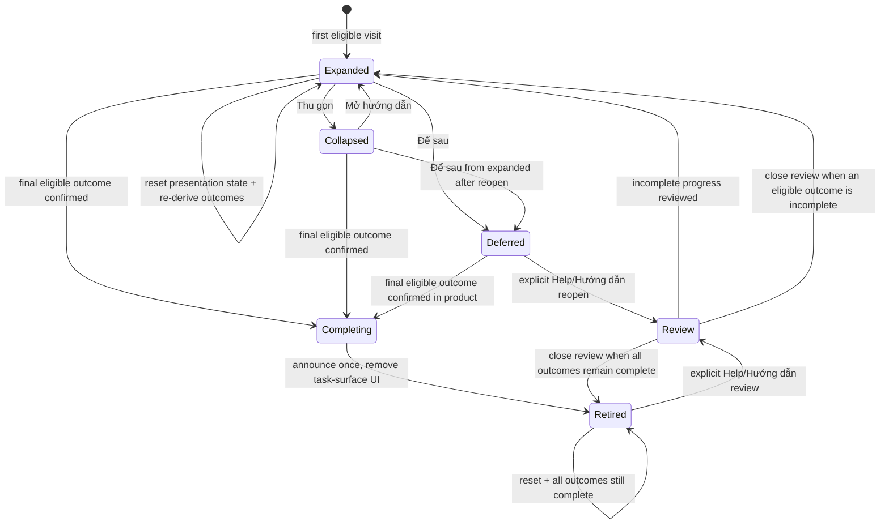

# Design Package: CGP-GUIDE-002 — Guidance semantics và Graph Safe Area

Version: 1.0 — Design review candidate
Date: 2026-07-11
Owner: UI/UX Designer
Approval status: Chờ PO/BA review
Dependency: CGP-GUIDE-001 approved and implemented
Supersedes only: checklist lifecycle controls, completed-state visibility, workspace responsive
availability, manual visual guidance, and workspace overlay placement rules from CGP-GUIDE-001.

## 1. Revision interpretation

### Product problem

The implemented guidance foundation has ambiguous control semantics and unsafe responsive placement:

- `Để sau` and `Ẩn hướng dẫn bắt đầu` compete without a clear difference.
- Completion leaves a persistent card/launcher instead of retiring.
- The workspace checklist is hidden at `≤768px`.
- Workspace overlays use viewport offsets rather than actual occupied layout regions.
- Contextual notes explain concepts but do not provide an explicit “show me the control” path.

### Desired outcome

- Checklist, manual short tour, and contextual note each have one distinct job.
- Collapse, defer, complete, retire, review, and reset have observable, non-overlapping effects.
- `Chỉ tôi` starts a short, explicit, goal-specific visual tour and never auto-runs.
- Incomplete guidance remains reachable at 1280×800, 768×1024, and 375×667.
- Workspace overlays remain inside a reactive Graph Safe Area.
- Canonical Help, role eligibility, product-derived completion, local privacy-safe state, and
  conditional-topic exclusions from CGP-GUIDE-001 remain unchanged.

### Locked decisions honored

- Remove `Ẩn hướng dẫn bắt đầu` from the checklist.
- Collapse creates a current-visit launcher; defer removes automatic presence for the current visit.
- Final eligible completion announces once and retires checklist/automatic launcher.
- Reset exists only in Help or Settings and cannot undo product-derived outcomes.
- No automatic tour. Reopen/review never auto-starts a tour.
- Mobile/tablet keep equivalent guidance access; no breakpoint-level hiding.
- All workspace overlays obey actual exclusion-zone bounds.

### Non-goals preserved

No graph/shell/navigation/toolbar/Help redesign; no new capability; no analytics; no auth,
permission, privacy, kinship, API, persistence, CMS, chatbot, video, multilingual, or gamification
change.

### Genuine PO/BA questions

None. The product revision provides sufficient locked decisions for implementation-usable design.

## 2. Current implementation evidence

### Observed state behavior

| Current implementation | Evidence | Revision consequence |
|---|---|---|
| `hidden` returns an inline `Xem hướng dẫn bắt đầu` button | `GuidanceChecklist` branch | Remove `hidden` as a checklist action/state; reopen belongs to approved Help/Hướng dẫn entry |
| `collapsed || skipped` renders the same collapsed card | Shared render branch | Split collapsed launcher from deferred/no automatic presence |
| Completed items still render `Bạn đã hoàn tất…` | No retire branch | Add completing announcement → retired state |
| Two footer actions: `Để sau` and `Ẩn hướng dẫn bắt đầu` | Checklist footer | Remove hide; add explanatory defer helper |
| Workspace position uses `top:7rem`, `right:1rem`, `bottom:11rem` | `_03_tree_workspace.scss` | Replace observable behavior with safe-area placement contract |
| Workspace checklist has `display:none` at `≤768px` | Responsive CSS | Recompose as launcher/modeless sheet |
| Context note is positioned inside same fixed guidance stack | `ContextNote` + CSS | Register it as an overlay participant; establish priority/collision rules |
| No `Chỉ tôi` action or goal model | Checklist/context note | Add manual, replayable, 1–3 step goal tour |

### Visual audit

Current deterministic prototype states were rendered at desktop, tablet, and mobile with no page
overflow. The evidence confirms that:

- collapse and defer are visually indistinguishable;
- completed guidance remains visible;
- mobile/tablet workspace loses the checklist while the contextual note remains;
- the workspace note/card stack can compete with the command toolbar and graph controls.

## 3. Guidance-layer responsibilities and trigger matrix

| Layer | User question | Automatic trigger | Manual entry | Completion effect | Placement |
|---|---|---|---|---|---|
| Product checklist | “Tôi nên đạt outcome nào tiếp?” | First eligible visit expanded; returning incomplete may show launcher | Launcher, Help/Hướng dẫn review | Only confirmed product outcomes | Page flow or safe-area launcher/sheet |
| Manual short tour | “Control đó ở đâu và dùng thế nào?” | Never | `Chỉ tôi` or explicit replay | Never completes/defer/dismisses checklist | Graph Safe Area only |
| Contextual note | “Khái niệm, điều kiện hoặc lỗi này có nghĩa gì?” | Conditional, one eligible note at a time | Help/Hướng dẫn or local trigger | Never completes checklist | Inline preferred; safe-area overlay when appropriate |
| Canonical Help | “Tôi cần hướng dẫn đầy đủ” | Never | Existing Help entry/deep link | No checklist completion | Normal Help page |

### Overlay priority

Highest to lowest:

1. Product blocking surface: destructive confirmation, modal, open drawer/menu, validation focus.
2. Manual short tour explicitly started by the user.
3. User-opened contextual note.
4. Eligible automatic contextual note.
5. Checklist launcher.

Rules:

- A lower-priority overlay yields its Graph Safe Area slot without being marked complete/dismissed.
- Starting a manual tour suspends any note and launcher. The launcher returns when the tour ends if
  the checklist is still incomplete and not deferred.
- Suspended automatic notes do not auto-restore in the same interaction; they remain eligible for a
  later safe context.
- Product modal/drawer/destructive confirmation pauses or cancels visual guidance and removes target
  highlighting immediately.

## 4. Revised lifecycle model

### State axes

Product completion and guidance presentation remain independent:

```text
Product outcomes: incomplete item(s) | all eligible outcomes complete
Presentation: expanded | collapsed launcher | deferred-current-visit | completing | retired | review
Tour: idle | running | paused | cancelled | finished
```

### State transition diagram



### Detailed state table

| State | Visible surface | Entry | Exit | Persisted meaning | Accessibility |
|---|---|---|---|---|---|
| Default/incomplete expanded | Full checklist | First eligible visit or explicit reopen | Collapse, defer, product completion | Current presentation preference only | Named section + progress list |
| Collapsed launcher | One-line/pill launcher with next step | `Thu gọn` | Open, defer via reopened checklist, completion | Current visit only | Button name includes next step |
| Deferred current visit | No automatic checklist/launcher | `Để sau` | Explicit reopen or next eligible visit | Visit-scoped defer only | No hidden focusable remnants |
| Explicit reopen | Checklist opens as review/current progress | Help/Hướng dẫn | Close/collapse/defer | Does not reset progress | Focus lands on checklist heading |
| Item completing | Item shows non-color pending/confirmed transition | Product outcome resolving | Success or product error | No completion until confirmed | `aria-busy`/polite result; no repeated count |
| Final completing | Concise announcement only | Last eligible outcome confirmed | Retired | Completion remains outcome-derived | One polite announcement |
| Retired | No checklist or automatic launcher | After announcement | Explicit review only | All current eligible outcomes complete | No permanent completion card |
| Retired review | Read-only outcome review + optional `Chỉ tôi` replay | Help/Hướng dẫn | Close | Completed items remain complete | Heading states “Xem lại…” |
| Reset entry | Settings/Help utility row | User selects reset | Confirm/cancel | None until confirmed | Consequence visible before confirm |
| Reset result | Success status in Settings/Help | Confirm reset | Close or explicit `Xem hướng dẫn` | Presentation/note/tour preferences cleared | Polite confirmation; no auto tour |

### Observable definition of current visit

After `Để sau`, automatic checklist/launcher does not reappear during continuous navigation in the
same open app tab. It may return on a new eligible browser/app visit. Exact storage/session mechanics
belong to engineering; the user-visible boundary must be consistent within one open-tab journey.

### Final completion behavior

1. Product state confirms the final eligible outcome.
2. If checklist/launcher is visible, its content is removed without requiring user action.
3. Announce once: `Bạn đã hoàn thành các bước bắt đầu. Bạn có thể xem lại trong Trợ giúp.`
4. No persistent card, launcher, badge, confetti, or automatic tour remains.
5. If final completion occurs while deferred, the announcement may be delivered through the global
   polite status region, then guidance remains retired.

### Reset behavior

Reset clears only device-local presentation preferences, dismissed note versions, and tour replay
state. After reset:

- product outcomes are immediately re-derived;
- outcomes still true remain complete;
- if all eligible outcomes remain true, checklist remains retired;
- if outcomes are incomplete, Settings/Help offers `Xem các bước hiện tại`; no tour auto-starts;
- automatic checklist behavior may resume on the next eligible visit, not through a surprise overlay
  while the confirmation is closing.

## 5. Control hierarchy and final Vietnamese copy

### Expanded incomplete checklist

Hierarchy:

1. Primary product action: `Làm bước này`.
2. Secondary visual help when target eligible: `Chỉ tôi`.
3. Tertiary knowledge link: `Xem cách làm`.
4. Header utility: `Thu gọn`.
5. Footer defer: `Để sau` plus explicit consequence helper.

`Ẩn hướng dẫn bắt đầu` is absent.

| Control/location | Visible copy | Helper/accessibility copy | Result |
|---|---|---|---|
| Collapse | Thu gọn | `Thu gọn hướng dẫn; vẫn hiện bước tiếp theo trong lượt này` | Creates launcher |
| Defer | Để sau | `Đóng hướng dẫn trong lượt này. Tiến độ vẫn được giữ.` | Removes automatic presence this visit |
| Task | Làm bước này | Action name may use exact task label | Opens task, no automatic completion |
| Manual tour | Chỉ tôi | `Chỉ vị trí điều khiển cho bước <item>` | Starts selected goal tour only |
| Help | Xem cách làm | Deep link to canonical topic | Opens Help, no completion |
| Launcher | Bước tiếp theo: {item} | Button: `Mở hướng dẫn — bước tiếp theo: {item}` | Reopens incomplete checklist |
| Reopen incomplete | Xem các bước bắt đầu | `Mở tiến độ hướng dẫn hiện tại` | Opens current progress |
| Review retired | Xem lại các bước đã hoàn thành | `Không đặt lại tiến độ` | Opens review mode |

### Completion/reset copy

| Location | Final copy |
|---|---|
| Final announcement | Bạn đã hoàn thành các bước bắt đầu. Bạn có thể xem lại trong Trợ giúp. |
| Settings/Help section title | Hướng dẫn sử dụng |
| Reset action | Đặt lại hướng dẫn |
| Reset helper | Đặt lại các mẹo đã đóng và cách hiển thị hướng dẫn trên thiết bị này. Những việc bạn đã hoàn thành trong cây vẫn được giữ. |
| Confirmation title | Đặt lại hướng dẫn? |
| Confirmation body | Các mẹo đã đóng sẽ có thể xuất hiện lại. Tiến độ được xác nhận từ cây gia phả không thay đổi. Không có dữ liệu gia đình nào bị sửa. |
| Cancel reset | Giữ nguyên |
| Confirm reset | Đặt lại |
| Reset success | Đã đặt lại cách hiển thị hướng dẫn trên thiết bị này. |
| Post-reset incomplete action | Xem các bước hiện tại |

### Manual tour copy

| Purpose | Final copy |
|---|---|
| Tour eyebrow | Chỉ dẫn nhanh · Bước {current} trong {total} |
| Cancel | Dừng hướng dẫn |
| Next | Tiếp |
| Final | Xong |
| Replay | Chỉ tôi lần nữa |
| Offscreen action | Đưa tôi tới vị trí |
| Paused by layout | Vị trí điều khiển vừa thay đổi. Hãy tiếp tục khi màn hình đã ổn định. |
| Target absent | Không tìm thấy điều khiển này trong trạng thái hiện tại. |
| Target disabled | Bước này chưa thể dùng. Hãy hoàn thành điều kiện được nêu bên dưới. |
| Permission-ineligible | Bạn không có quyền dùng thao tác này trong cây hiện tại. |
| Recovery to checklist | Quay lại bước bắt đầu |
| Recovery to Help | Mở hướng dẫn chi tiết |

## 6. Manual `Chỉ tôi` flow

### Entry and exit

1. User selects `Chỉ tôi` on one eligible checklist item or explicit Help/Hướng dẫn replay action.
2. The selected goal is frozen for this invocation; unrelated checklist items are not appended.
3. Safe-area placement is evaluated before any target outline/card renders.
4. Tour begins only if the first step is eligible and can be represented safely; otherwise the user
   receives the goal-specific fallback.
5. `Dừng hướng dẫn`, Escape, route change, permission loss, or destructive flow cancels the tour.
6. Close/cancel restores focus to the `Chỉ tôi` trigger if it exists; otherwise to the surviving
   checklist launcher or relevant Help heading.
7. Finish removes tour UI and returns checklist/launcher according to its prior presentation state.
8. Start, cancel, and finish do not complete, defer, collapse, or dismiss checklist/contextual state.

### Goal-specific step model

Each invocation contains one goal and one to three steps maximum:

```text
TourGoal {
  goalId: categorical ID
  checklistItemId?: approved item ID
  topicId: active canonical Help ID
  role/state eligibility
  steps: 1..3, all necessary for the same goal
}

TourStep {
  stepId: categorical ID
  targetDescriptor: semantic purpose + visible variants
  instruction: canonical contextual excerpt key
  expected user action: inspect | activate | select
  placementPreference
  disabled/absent/offscreen recovery
}
```

The model must not contain a generic “next feature” edge. A finished goal returns to the checklist;
the user explicitly chooses another `Chỉ tôi` invocation.

### Approved Phase-1 tour goals

| Goal | Max steps | Targets | Stop condition |
|---|---:|---|---|
| Create/open tree | 1 | Visible create button or tree-card open action | Target shown; user may act |
| Add first person | 1 | Empty-tree form heading/first required field | Target shown |
| Add primitive relation | 2–3 | Select person if needed → `Thêm quan hệ` → primitive mode choice | Final control shown or task state opens |
| Inspect address | 2 | Visible person node → info/address panel | Selected node/address panel shown |
| Change viewpoint | 1 | Visible responsive viewpoint control | Control shown |
| Navigate graph (manual replay) | 1 | Visible graph navigation controls | Control group shown |
| Search (manual replay) | 1 | Visible search control | Control shown |

No conditional or unpublished topic can produce a tour goal.

### Target variants and recovery

| Target state | Tour behavior |
|---|---|
| Visible and eligible | Outline target without covering it; place card in safe candidate region |
| Relocated | Resolve the visible semantic variant and recompute; step identity does not change |
| Offscreen but eligible | Do not auto-scroll. Offer `Đưa tôi tới vị trí`; only after explicit activation may product scroll/focus |
| Disabled | No misleading highlight. Dock an explanation with prerequisite and Help link |
| Absent | Stop goal and show absent fallback; return to checklist/Help |
| Permission-ineligible | Stop immediately; never reveal hidden target location/copy beyond approved permission message |
| Loses eligibility mid-step | Remove outline/connector immediately; pause/stop with correct recovery |
| Route/layout changes | Pause visual target; resolve again on stable destination if still same goal, otherwise cancel |

## 7. Graph Safe Area specification

### Definition

Graph Safe Area is the currently usable portion of the rendered graph canvas after subtracting
every active exclusion zone and a viewport-edge safety band. It is not a fixed rectangle and is not
derived from viewport offsets alone.

```text
Safe region candidates = Graph canvas bounds
  minus union(active registered exclusion zones)
  minus target protection zone
  minus viewport/system safety insets
```

The result may be multiple disconnected candidate rectangles. The overlay uses a valid candidate or
an approved non-overlay fallback.

### Registered exclusion zones

| Zone | Active when | Protected behavior |
|---|---|---|
| Application navbar/mobile top bar | Visible | No overlay/highlight/launcher intersection |
| Sidebar | Expanded or collapsed | Use actual width; collapsed icon rail still protected |
| Mobile drawer + scrim | Drawer open | Suspend workspace guidance; drawer owns interaction |
| Tree command/header toolbar | Visible in current responsive location | Protect full rendered bounds, including wrapped second row |
| Graph navigation controls | Visible | Keep controls and 12px interaction halo clear |
| Bottom command toolbar | Visible | Launcher/sheet sits above actual toolbar bounds |
| Info/details panel | Open/animating/closed | Protect current rendered bounds; update after state change |
| Search/legend/menu popover | Open | Treat its bounds as temporary exclusion; lower-priority guidance yields |
| Modal/destructive confirmation | Open | Suspend/cancel workspace guidance; do not layer above |
| On-screen keyboard/IME/system inset | Reduces visual viewport | Keep sheet/card within remaining visual area |
| Viewport edge | Always | 12px desktop/tablet; 16px mobile preferred safety band |
| Target protection zone | Target visible | Target bounds plus minimum 12px gap; overlay never covers target |

### Placement priority

#### Desktop

1. Right of target inside a safe candidate.
2. Left of target.
3. Below target.
4. Above target.
5. Dock in unused info-rail/safe canvas edge.
6. Non-overlay inline card or Help fallback.

#### Tablet

1. Below/above target inside safe canvas.
2. Side placement only if target and toolbar remain fully clear.
3. Docked modeless sheet above actual bottom toolbar.
4. Inline/Help fallback.

#### Mobile

- No free-floating explanatory card over graph nodes.
- Use target outline plus a modeless bottom sheet docked above the actual command toolbar and visual
  keyboard inset.
- If the safe vertical area cannot show heading, instruction, cancel, and one action at 200%, remove
  target overlay and use a normal-flow Help/task fallback.
- Launcher is a 48px safe-area participant placed above toolbar/controls, never `display:none`.

### Candidate validity

A placement is valid only when:

- the full overlay including shadow/focus ring lies inside a safe candidate;
- it does not overlap any exclusion or target protection zone;
- the target and primary action remain visually and interactively available;
- required content/actions fit without clipping at current text scale;
- its connector, if used, does not cross a protected control; connectors are optional and never the
  sole cue.

### No valid placement

Priority order:

1. Remove connector/spotlight and use a docked modeless sheet in remaining safe space.
2. Use inline guidance inside the checklist/task panel.
3. Stop/pause the tour with `Quay lại bước bắt đầu` and `Mở hướng dẫn chi tiết`.
4. Never render an orphan tooltip, cover a target, or use an unauthorized/disabled target as if active.

### Reactive behavior

Re-evaluate safe bounds when viewport/orientation, visual keyboard, text scale, sidebar/drawer, info
panel, toolbar wrapping, target geometry, menu/modal, or product layout changes.

Observable rules:

- During active geometry change, remove connector/spotlight first. Keep a safely docked card or pause.
- After layout stabilizes, choose a valid placement from current actual bounds.
- Do not animate a card across unrelated regions. Reduced motion makes repositioning immediate.
- If the target changes to another responsive variant, preserve goal/step identity and update the
  instruction only if the canonical excerpt explicitly differs.
- If no safe candidate remains, transition to fallback instead of retaining stale coordinates.
- Graph layout itself does not shift to make room for guidance.

## 8. Contextual-note coexistence

- Prefer contextual notes inline within the form/panel that owns the decision or recovery.
- A workspace contextual overlay registers with the same safe-area contract and uses the overlay
  priority in section 3.
- Starting `Chỉ tôi` removes/suspends an automatic contextual note without marking it dismissed.
- A user-opened note is closed from the overlay slot when tour begins; it remains available through
  the original control/Help but does not surprise-reopen after the tour.
- Contextual notes never become multi-step tours and never display `Tiếp`.
- Loading, validation, permission, privacy, or destructive states use nearby inline explanations,
  not floating callouts.

## 9. Responsive information hierarchy

### Tree list

- Expanded checklist remains inline below page heading.
- Collapse replaces it with a compact launcher row; defer removes it for current visit.
- Final completion removes both; Help remains the review entry.

### Desktop workspace — 1280×800

- Incomplete checklist launcher uses an unoccupied safe edge/idle rail, subject to info-panel bounds.
- Full checklist opens as a modeless panel within safe area, not a fixed viewport stack.
- Manual tour uses target outline plus a nearby safe card.

### Tablet workspace — 768×1024

- Checklist launcher remains reachable above the actual bottom command toolbar.
- Expanded checklist uses a docked modeless sheet or available info-panel region.
- Manual tour uses target outline + docked sheet if floating placement is unsafe.
- Opening the app drawer suspends workspace overlays.

### Mobile workspace — 375×667

- A 48×48 launcher remains available above the actual bottom toolbar when checklist is incomplete.
- Expanded checklist/manual tour uses a modeless bottom sheet without scrim/focus trap.
- Sheet has content-driven height, internal scroll if necessary, and maximum two visible primary
  footer actions.
- Sheet/launcher repositions above the visual keyboard; if insufficient at 200%, use normal-flow
  fallback after user action.

### Empty tree

- The first-person form remains dominant.
- `Chỉ tôi` may focus/outline the first required field only after explicit request.
- No floating checklist covers form fields or submit action.

### Help and Settings

- Incomplete: `Xem các bước hiện tại`.
- Retired: `Xem lại các bước đã hoàn thành`.
- Reset appears as a separate utility section with consequence helper and confirmation.
- Reset never shares a row with normal checklist task actions.

## 10. Accessibility specification

### Checklist and launcher

- Checklist is `<section aria-labelledby>` with a semantic list and text progress.
- Launcher is one named button, not an unlabeled floating icon. Icon-only mobile presentation must
  retain an accessible name including the next step.
- Collapse and defer are separate visible controls; defer helper is programmatically associated.
- Item completion updates only after confirmed product state. `aria-busy` may represent pending task
  confirmation; final success announcement occurs once in a persistent global polite live region.

### Manual tour

- Manual start moves focus to the named tour heading or first tour control; it never traps focus.
- Screen-reader step label: `Chỉ dẫn nhanh, bước X trong Y: <title>`.
- Logical order: heading/instruction → target relation description → cancel → next/finish/Help.
- Target receives a programmatic relationship to the active instruction when safe; visual outline is
  not the only association.
- Escape cancels current tour without changing checklist state and restores focus as specified.
- If target disappears, screen reader hears the recovery status once; no stale `aria-describedby`.

### Contextual notes

- Automatic note does not move focus.
- Interactive note is a named non-modal region/dialog, never `role=tooltip`.
- Inline permission/privacy/validation notes stay adjacent to the owning control.

### Touch, scaling, and motion

- All controls: 44×44 minimum, 48×48 target.
- At 200%: no fixed card height; footer actions stack; safe area uses rendered overlay size including
  focus rings; if minimum content cannot fit, use fallback.
- Reduced motion removes target pulse, animated connector, and travel animation. Status, numbering,
  text, and outline preserve meaning.
- No instruction depends only on color, hover, gesture, spotlight, or connector.

## 11. Required states

| State | Designed behavior |
|---|---|
| Checklist default/incomplete | Expanded, outcome-driven, clear task/`Chỉ tôi`/Help hierarchy |
| Collapsed launcher | Current visit, next-step named, all breakpoints |
| Deferred | No automatic presence current visit; explicit reopen available |
| Current-visit reopen | Opens current progress, no reset/tour |
| Item completing | Pending not counted; error returns incomplete |
| Final completing | One polite announcement then retire |
| Retired | No task-surface card/launcher |
| Retired review | Read-only progress/replay, no outcome reset |
| Reset entry/result | Help/Settings only; consequence + confirmation + result |
| Tour idle/running/cancelled/finished | Manual-only; independent of checklist state |
| Target visible/relocated | Safe placement and semantic variant resolution |
| Target offscreen | Explicit `Đưa tôi tới vị trí`, no auto-scroll |
| Target disabled/absent/ineligible | Stop/dock explanation; no misleading highlight |
| Safe placement unavailable | Docked/inline/Help fallback |
| Layout changing | Remove connector, pause/dock, recompute from actual bounds |
| Competing contextual note | Overlay priority/suspension; no accidental dismissal |
| Loading/API error | No auto surface; pending outcome not complete |
| Validation | Inline error owns focus; visual guidance pauses |
| Modal/drawer conflict | Suspend/cancel workspace overlay |
| Destructive confirmation | Cancel/pause tour; no layered guidance |
| Desktop/tablet/mobile | Equivalent access using viewport-specific composition |
| 200%/reduced motion | Content/action preserved, safe fallback available |

## 12. Prototype synchronization and visual verification matrix

### Deterministic prototype states

| Surface | Required query/state variants |
|---|---|
| `/prototype/tree-list` | `guide=incomplete|collapsed|deferred|completing|retired|review|reset` |
| `/prototype/tree` | `guide=launcher|checklist|tour|note|none`; `goal=<approved-goal>` |
| Workspace target | `target=visible|relocated|offscreen|disabled|absent|ineligible` |
| Workspace layout | `layout=sidebar-expanded|sidebar-collapsed|drawer-open|info-open|menu-open|keyboard` |
| Help | `guide=incomplete|retired|reset-confirm|reset-success`; direct active topic hash |
| Settings | reset entry/confirm/success and incomplete/retired review labels |

All states use fictional deterministic data, no authenticated/upcoming-events API, no private IDs,
and only active canonical topics.

### Visual/interaction matrix

| Viewport | Layout/state combinations | Required assertions |
|---|---|---|
| 1280×800 | Sidebar expanded/collapsed; info open/closed; target near each edge; toolbar/menu open | Overlay within safe candidate; no intersection; launcher reachable |
| 768×1024 | Drawer closed/open; wrapped toolbar; info panel; tour/checklist/note | Drawer suspends overlays; launcher/sheet above actual toolbar |
| 375×667 | Portrait; launcher; sheet; target variants; keyboard inset; info panel | No CSS hide; 48px launcher; no toolbar/edge overlap; internal scroll |
| Mobile landscape/orientation change | Active tour then rotate | Connector removed; safe recompute or fallback |
| All three at 200% | Checklist, launcher, tour fallback, reset confirmation | No clipping/overflow; controls/actions remain reachable |
| All three reduced motion | Tour start/reposition/finish | No essential motion; equivalent information |

Geometry tests must compare rendered overlay bounds with every registered exclusion rectangle and
viewport safety band. Tests must fail on any intersection, not rely on screenshots alone.

## 13. Reused and changed patterns

### Reused unchanged

- Canonical Help registry, stable topic IDs, excerpt traceability.
- Existing role/state gates and confirmed product completion logic.
- Warm card language, semantic tokens, buttons, focus-visible, Help deep links, safe return.
- Device-local privacy-safe guidance state with no analytics emission.

### Changed

- Split collapsed and deferred render behavior.
- Remove `hidden`/`Ẩn hướng dẫn bắt đầu` from checklist semantics.
- Add completing → retired lifecycle and review-only retired state.
- Replace CSS hiding on tablet/mobile with launcher/sheet composition.
- Add manual goal-specific tour via `Chỉ tôi`.
- Move all workspace overlays under the Graph Safe Area contract.

### New experience patterns

- `GuidanceLauncher`: compact, safe-area registered current-visit access.
- `GoalTour`: manual 1–3-step visual guidance for one selected outcome.
- `Graph Safe Area`: dynamic exclusion-zone placement contract.
- `GuidanceReset`: Help/Settings utility with consequence confirmation.

These are behavior contracts, not prescriptions for a positioning library or DOM architecture.

## 14. Alternatives considered

| Alternative | Benefit | Risk/tradeoff | Decision |
|---|---|---|---|
| Rename `Ẩn` but keep both footer actions | Small change | Meaning still overlaps defer; creates permanent-hide debt | Rejected by locked decision |
| Keep completed card collapsed | Visible success history | Permanent space, no next action | Rejected by locked decision |
| Restore one automatic workspace tour | Easy discovery demo | Recreates interruption and generic linear tour | Rejected |
| Use viewport-specific fixed offsets | Fast per screenshot | Drifts with sidebar, toolbar, panel, keyboard, 200% | Rejected |
| Hide guidance on small screens | Avoids overlap | Removes capability for mobile/tablet users | Rejected |
| Manual goal tour + dynamic safe area + modeless fallback | Explicit help, cross-layout safety, preserves graph | Requires shared geometry discipline and state coverage | Recommended/locked-compatible |

## 15. Annotated visual artifacts

- `visual-01-lifecycle.svg/.png` — collapse, defer, completing, retire, review, reset lifecycle.
- `visual-02-safe-area-desktop.svg/.png` — desktop exclusion zones and placement candidates.
- `visual-03-safe-area-tablet.svg/.png` — tablet launcher/sheet and drawer/info-panel response.
- `visual-04-safe-area-mobile.svg/.png` — mobile safe area, bottom toolbar, keyboard inset, 200% fallback.
- `visual-05-manual-tour.svg/.png` — explicit `Chỉ tôi` goal flow and target recovery variants.

Visuals are interaction references. They preserve the existing product shell/graph language and do
not authorize unrelated redesign.

## 16. Acceptance-criterion mapping

| AC | Design evidence |
|---|---|
| AC1 | Sections 4–5: separate collapse/defer; hide action absent |
| AC2 | Lifecycle table + desktop/tablet/mobile launcher specs |
| AC3 | Deferred state and current-visit definition |
| AC4 | Final completing → announcement → retired contract |
| AC5 | Reopen/review/reset behavior and copy; outcome re-derivation |
| AC6 | Manual-only trigger matrix and 1–3-step goal model |
| AC7 | Target variants/recovery table and no-orphan rule |
| AC8 | Safe-area definition, exclusion zones, validity criteria |
| AC9 | Reactive behavior on every required layout/bounds change |
| AC10 | Responsive hierarchy and three-viewport verification matrix |
| AC11 | Section 10 + 200%/reduced-motion matrix |
| AC12 | Reused canonical/eligibility/privacy foundation; no analytics/capability expansion |
| AC13 | Deterministic production/prototype states and geometry assertions |

## 17. Design acceptance checklist

- [x] Collapse, defer, complete, retire, review, and reset are unambiguous.
- [x] `Ẩn hướng dẫn bắt đầu` is absent.
- [x] Completion announces once and leaves no permanent card/launcher.
- [x] Reset cannot undo product-derived outcomes or auto-start a tour.
- [x] `Chỉ tôi` is explicit, goal-scoped, cancelable, and replayable.
- [x] Automatic triggers cannot start a visual tour.
- [x] Target absent/disabled/offscreen/relocated/ineligible recovery is specified.
- [x] Graph Safe Area uses actual exclusions, not magic offsets.
- [x] Reactive layout, drawer, panel, toolbar, keyboard, orientation, and text-scale behavior covered.
- [x] Incomplete guidance remains reachable on desktop, tablet, and mobile.
- [x] Accessibility, privacy, canonical content, and conditional exclusions preserved.
- [x] Prototype and geometry verification states are deterministic and complete.
- [x] No locked decision reopened and no genuine product question remains.
