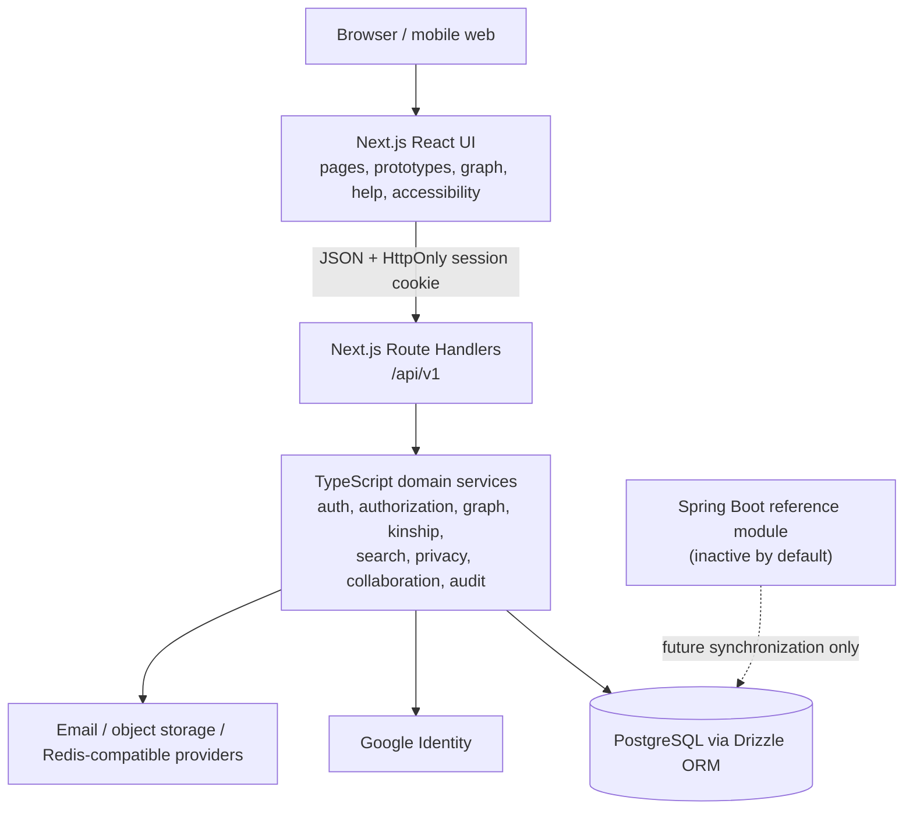
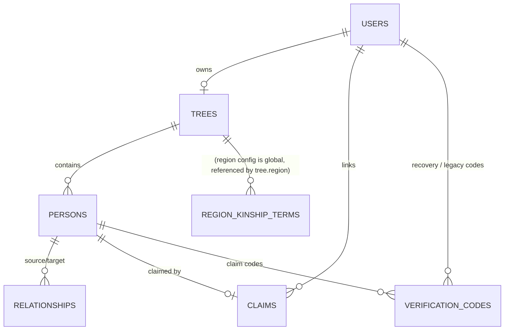
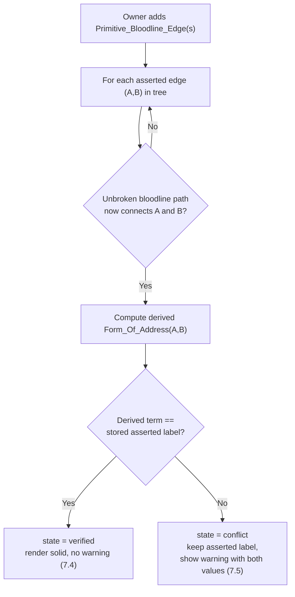

# Design Document: Vietnamese Family Tree (Cây Gia Phả)

## Overview

The Vietnamese Family Tree system lets a user build, own, collaborate on, and visualize one or more clans as a
relationship graph, with the defining feature being automatic computation of the correct
Vietnamese form of address (cách xưng hô) between any two persons. Address computation accounts
for paternal-vs-maternal side, gender, birth order/age, and regional dialect (Bắc/Trung/Nam).

The active system is built on this stack:

- **Application — Next.js 14 (React + Route Handlers).** Renders the product and hosts the active
  server-side API, session, authorization, domain-service, and persistence orchestration paths.
- **Persistence — Drizzle ORM + PostgreSQL.** Stores users, trees, persons, typed relationship
  edges, claims, sessions, visibility settings, collaboration data, reminders, and the
  region-keyed kinship-term configuration.
- **External dependencies.** Google Identity supports optional Google sign-in; configured email,
  object-storage, and Redis-compatible providers support invitation/recovery delivery, photos, and
  distributed rate limiting where enabled.
- **Inactive reference — Spring Boot (Java).** The Java module remains available for future
  synchronization and domain reference, but `USE_BACKEND=false` means it is not the production-
  priority runtime. New product behavior must be implemented in the Next.js application first.

> **Architecture decision record — 2026-07-13.** Email/password and Google are the active
> registration contract. Existing phone-only accounts retain password sign-in and SMS recovery
> compatibility, but new phone registrations are disabled. Verification codes remain bounded to
> password recovery and authenticated person-node linking.

### Design Goals and Key Decisions

1. **Store primitives, derive everything else.** Only `Primitive_Bloodline_Edge` (father-child,
   mother-child) and `Marriage_Edge` participate in kinship derivation. All higher-order terms
   (bác, chú, cô, dì, cậu, cháu, anh, em, …) are computed on demand by the `Kinship_Resolver`
   from the stored primitive graph. This keeps the data model small and makes regional dialect a
   pure lookup concern. (Requirements 4, 5, 8, 9)
2. **Two relationship modes.** A precise primitive relationship renders as a SOLID line and is
   fully derivable; an `Asserted_Relationship` (a direct label like "this person is my bác")
   renders as a DASHED line and is treated as opaque until intermediate nodes complete a path.
   (Requirements 5, 6, 7)
3. **Graph in a relational DB.** A `persons` table holds nodes and a single `relationships` table
   holds typed edges discriminated by a `type` column. Database constraints enforce the
   at-most-one-father / at-most-one-mother rule; application logic plus a recursive check enforce
   acyclicity. (Requirement 4)
4. **Region as configuration data, not code.** Kinship terms live in a `region_kinship_terms`
   table keyed by `(region, canonical_relation)`. The resolver computes a canonical relation from
   a path, then looks up the term for the tree's region. Adding or correcting a dialect is a data
   change, not a code change. (Requirement 9)
5. **Email/password or Google registration.** New users register with email/password or Google.
   Existing phone-only accounts remain compatible with password sign-in and SMS recovery when a
   provider is configured. Password verifiers are hashed, Google credentials are verified
   server-side, and sessions last 30 days. (Requirements 1, 2, 11)
6. **Explicit multi-tree scope.** Sign-up creates one initial tree, after which a User may explicitly
   create more. Every tree-scoped command carries a target `treeId`; no authorization decision may
   fall back to the first owned tree. (Requirement 13)

## Architecture

The production-priority system is a Next.js full-stack web application. Browser requests reach
Next.js pages and `/api/v1` Route Handlers in the same application. Route Handlers call TypeScript
domain services, persist through Drizzle/PostgreSQL, and use external providers only for bounded
capabilities such as Google identity, email delivery, photo storage, and distributed rate limits.



### Request Flow Summary

- **Authenticated requests** carry the `SESSION` cookie. Next.js Route Handlers resolve the session
  and apply Owner, Contributor, Linked_User, Reader, sharing, and privacy checks before
  returning or mutating family data.
- **Kinship computation** is read-only and runs against an in-memory projection of the tree's
  primitive graph loaded per request (or cached per tree, invalidated on edge mutation).
- **External identity and delivery** are bounded integrations. Google credentials are verified
  before a session is created. Recovery/claim codes are hashed, single-use, rate-limited, and
  delivered through the configured provider without being written to logs.

### Layering

The active Next.js implementation separates Route Handlers, TypeScript domain services, Drizzle
schema/query code, and React components. Pure kinship/search/graph logic remains isolated enough for
property-based tests. The Java controller/service/repository layering documents a reference design,
not the active request path.

### Security Considerations

- **Credential protection**: passwords follow the active policy (8–128 characters, letter + digit)
  and are stored only as one-way hashes. Unknown-account and wrong-password failures use a uniform
  response. Google credentials are verified server-side. Recovery/claim codes are single-use,
  hashed at rest, expire, and are rate-limited. (Requirements 1, 2, 11, 25)
- **Session security**: session tokens are random (≥128 bits), stored server-side, transmitted in
  an `HttpOnly`, `Secure`, `SameSite` cookie over HTTPS, and revocable on sign-out. The 30-day
  expiry is enforced server-side; expired/revoked sessions are rejected. (2.3, 2.8)
- **External providers are trust/availability dependencies**: Google or email/storage outages may
  degrade the bounded capability, but must not create an authenticated session, claim, or public
  photo without successful verification and authorization. Treat provider responses as untrusted.
- **Minimize unauthenticated surface**: sign-up, sign-in, Google auth, legal documents, recovery,
  and the public entry portion of invitation/claim flows are reachable without a session; these
  endpoints are rate-limited or otherwise bounded as appropriate.
  Every other endpoint requires an authenticated session, and all mutations additionally enforce
  the explicit role/capability model (Property 18). Avoid leaking whether an
  identifier exists beyond what Requirement 2.4 mandates.
- **Privacy enforcement server-side**: sensitive-field filtering (Property 20) is applied in the
  API, never relying on the client to hide private fields.

## Components and Interfaces

Active endpoints are implemented as Next.js Route Handlers under `/api/v1`. Family-data mutations
require an authenticated session and enforce an explicit target-tree capability. Responses are
JSON. Error responses use the envelope described in **Error Handling**.

### Authorization contracts

`AuthContext` contains authenticated account identity only: `{ userId, isAuthenticated }`. It does
not contain a default or owned tree. Tree authorization classifies the explicit target as
`OWNER`, `CONTRIBUTOR`, `LINKED`, `READER`, or `NONE`. `SessionUser` exposes identity and
`consentRequired`, never a singular `treeId`. Tree list/detail responses expose `accessRole`; tree
detail additionally exposes per-person capabilities so the client does not infer authority.

- Owner: full read, content, visibility, claim, collaboration, sharing, configuration, and deletion.
- Contributor: full trusted read and person/relationship/photo content editing; no visibility,
  claim, collaboration, sharing, configuration, rename, or tree deletion.
- Linked: full read/edit/photo/visibility for the linked node and privacy-projected read elsewhere.
- Reader: privacy-projected read only.

### Populated tree workspace UI contract

The populated `/tree/{id}` workspace is task-first and keeps the server-projected person and
relationship graph as its only data source. It has two persisted view modes:

- `list` is the default on mobile and tablet. The list groups only direct primitive relationships
  as “Người thân gần”; all remaining projected people appear under “Các thành viên khác”.
- `graph` uses the existing `TreeGraph` engine, layout, privacy projection, edge semantics, and
  pan/pinch behavior. Every gesture has a labelled button equivalent.

The browser preference key is `cgp_tree_workspace_view_v2`. Legacy `focus` and `list` values migrate
to `list`; `graph` remains `graph`; unknown values fall back to `list`. On containers below 960 CSS
px both panels remain mounted, the inactive panel is `inert`, and the tab change uses a reduced-
motion-safe translate. At 960 CSS px and above, container queries present a split workspace with a
`clamp(320px, 34%, 420px)` list rail and graph canvas.

The workspace header is a compact context bar containing a stable route back to the tree list,
“Xét vai vế theo [Tên]”, and a labelled “Đổi người xét” picker. `viewpoint` remains the stable
internal type, telemetry, and REST-path term; “góc nhìn” remains reserved for camera/zoom controls.
The shared picker receives the already loaded
`persons` and `addresses`, supports Vietnamese diacritic-insensitive search, traps focus, restores
focus to its trigger, and does not request a new API. Selecting a person opens the existing detail
surface as a bottom sheet on narrow containers and a side panel on wide containers.

Workspace drawers and person panels use fixed chrome plus exactly one internal body/list scroll
owner. Contextual Coach content is an absolute overlay outside that scroll region and never pushes
rows. Only one workspace Coach sequence is active at a time; opening another chapter dismisses the
prior visual sequence without persisting completion or skip. The viewpoint picker keeps search and
count in its fixed chrome and scrolls only the person list.

The person surface uses one reducer-owned state `{ personId, mode }`, where mode is `view`, `edit`,
`add-person`, or `update-relationship`; a null `personId` closes the surface. Child modes render Back
and Close as separate controls, share dirty-form discard handling, and restore focus to their
respective opener. `AddConnectedPersonForm` atomically creates a Person plus one primitive edge via
`POST /trees/{treeId}/relatives`. `UpdateRelationshipForm` keeps the viewed Person fixed and creates
only a missing parent, child, or spouse edge between two existing nodes via `POST /relationships`.
Asserted-edge APIs, rendering, upgrades, and conflicts remain supported, but no populated-workspace
form offers asserted creation until that interaction is redesigned.

All person-photo entry points use one controlled `PhotoFilePicker`. It keeps the native file input
keyboard and screen-reader accessible while presenting a shared dropzone, preview, replace, and
remove interaction. JPEG and PNG files up to 5 MiB are accepted before the existing upload request
is made. If a new Person is saved but the optional photo upload fails, the UI retains the created
Person id and offers a route to that profile instead of allowing the create request to run again.

The footer is capability-driven. “Thêm người mới” chooses the selected editable Person, then the
editable viewpoint Person, then the first editable Person as its connection anchor. Text search and
combinable filters live in controlled, fixed chrome above the member rows and operate on the already
projected people, relationships, and addresses; only the result list scrolls, and search text is
never sent to analytics. Browser speech recognition is not part of this surface. “Cập nhật quan hệ”
lives in the viewed Person's action group. The action drawer contains only guidance and management
destinations. Viewpoint change, quick guidance, and canonical Help remain available to all readable
roles; editing, settings, and collaboration actions appear only when the corresponding server
capability is true. Client role labels never grant authority.

The action surface is a compact right drawer on desktop and a bottom sheet with vertical enter and
exit motion on mobile/tablet. Graph controls are compact on wide containers. On mobile/tablet, the
opened control surface presents exactly eight primary actions in a 4×2 grid; selected-person
centring and full Help remain outside that grid. Every control remains keyboard/tap reachable with a
minimum 44 CSS-px target. Graph node, canvas, and control colours use semantic tokens in light,
dark, and system themes; line style as well as colour identifies edges.

Graph geometry uses a compact text-scale-aware profile rather than estimating card width from name
length. Node dimensions interpolate from 176×128 CSS px at 100% text to 192×156 at 150% and
208×184 at 200%; horizontal node gap is 24px, generation gap is 96px beyond card height,
disconnected-component gap is 72px, and the graph world retains 64px content padding. Names render
at most two visual lines while their complete accessible name and tooltip remain available. Every
marriage, bloodline, asserted, social, and unidentified connector consumes the same node geometry
and terminates at the relevant card boundary.

The graph camera reserves 48 CSS px around the usable viewport and clamps every mouse, touch,
wheel, button, reset, resize, fullscreen, and center-on-node transform. Its full-fit zoom uses the
padded viewport; the effective minimum is `clamp(fitZoom, 0.12, 0.5)` and the maximum is 2. A graph
smaller than the padded viewport is centered on that axis; otherwise pan is bounded between the two
48px edge positions. Wheel and pinch preserve their pointer/midpoint world anchor, while button
zoom preserves the viewport-center world anchor.

These layout contracts do not change capability checks, privacy projection, API contracts, or the
existing graph engine. `/prototype/tree` renders the shared production workspace components rather
than a parallel panel implementation; targeted tests and the three-viewport UI audit cover
responsive scroll ownership.

The populated-workspace onboarding uses four progressive Coach mark chapters: `overview`,
`actions`, `graph`, and `person`. The overview runs once after the workspace and its visible anchors
are ready. A contextual chapter runs only after the user opens its existing surface; guidance never
opens the action tray, changes tabs, expands graph controls, selects a person, or starts an edit flow
on the user's behalf. Steps resolve content from canonical Help topic IDs and skip missing anchors by
viewport/capability.

All four chapters use one measured anchor-placement engine. It observes the target, card, and owning
surface; tries the preferred side, its opposite, then the side with the most usable space; and keeps
12 CSS px between the card, target, and surface edge. The card has fixed progress/footer rows and an
internally scrolling body, and receives a constrained maximum height only when its natural measured
height cannot fit. Before placement, only the nearest marked panel scroll owner may be adjusted, with
no smooth scrolling; the workspace/page outside that surface is never scrolled. Four non-interactive
58%-black, 2px-blurred panes create an 8px-padded spotlight cutout around the active target. Overview
cards remain in the graph-safe card layer while their spotlight covers the full workspace; action,
graph, and person spotlights remain clipped to their owning content surfaces. Anchors identify a
specific selectable person row, address callout, person action group, photo header, drawer action, or
graph control rather than a large enclosing section.

Completion, Skip, or Escape persists an independent chapter decision in schema-5
`GuidanceState.workspaceCoach = { version: 2, chapters }`. Typed replay events reopen only the
requested chapter without clearing other decisions; Settings retains the overview replay, while the
action and graph control surfaces expose their chapter-specific replay controls. Schema-4 Coach
state migrates to the overview chapter, legacy `onboardingSkipped: true` still skips overview, and
existing checklist state is retained. Tree-list and empty-tree onboarding continue to use the
existing checklist.

### Marketing homepage and legal entry points

The public homepage and `/prototype/home` render one shared `HomeLanding` with an internal
`loading | signed-out | signed-in` state contract. State changes only the primary create/open-tree
action. The page keeps one long-form order: hero, value strip, practical problem, starting actions,
feature stories, Vietnamese kinship, privacy, audiences, FAQ, final action, and grouped footer.
Marketing navigation uses absolute homepage anchors for cách hoạt động, tính năng, and riêng tư so
the fixed Header and Hamburger remain correct from `/help`.

The hero and Open Graph card share a 1200×630 generated editorial illustration of a Vietnamese
multigenerational family. Its copy area remains clear on wide screens and becomes a separate image
row on mobile. Stable HTML/CSS conceptual artwork explains features without mirroring production UI
screens. The dedicated `_11_home.scss` owns every homepage selector and supports semantic theme
tokens, reduced motion, 100-200% text reflow, fixed-header anchor offsets, and horizontal-overflow
protection.

Homepage motion is progressive enhancement. `HomeScrollReveal` observes existing `.home-reveal`
markers once, adds the visible state as each section enters the viewport, and leaves all content
visible when animation is disabled or `IntersectionObserver` is unavailable. Reduced-motion users
receive no entrance movement. FAQ questions override the global button alignment, reserve a fixed
trailing icon slot, and keep left-aligned wrapping at every supported text scale.

The homepage footer groups product, support, and legal destinations. `LegalLinksCard` is shared by
production and prototype Settings and appears immediately before Data Rights. The sidebar does not
duplicate these legal links. Canonical ToS and Privacy routes, content, versions, consent behavior,
and data-rights behavior remain unchanged.

Canonical Help bumps `dieu-huong-so-do` and `xem-va-luu-so-do` whenever bounded-camera behavior
changes. User-facing guidance describes four-direction stopping, limited zoom, and Đặt lại restoring
the initial state without exposing implementation constants.

### Tree list presentation

Production `/tree` and `/prototype/tree-list` render the same `TreeListView`. The view presents a
truthful tree count and a semantic ordered catalog with visible row numbers, tree name, access role,
regional dialect, primary open action, and an Owner-only delete action. Desktop uses editorial rows
and dividers instead of elevated cards; tablet and mobile move actions below the row content while
preserving 44px minimum targets and page-width containment. The empty state retains the canonical
Guidance checklist and the shared add-tree entry point. Data fetching, create/join/delete callbacks,
confirmation, capability, and routing stay owned by the production page.

Sign-in and sign-up cross-links use complete prompts, respectively “Chưa có tài khoản? Đăng ký
ngay!” and “Đã có tài khoản? Đăng nhập ngay!”, while preserving invitation redirect and reason
parameters.

### Auth_Service

Handles password/Google sign-up, sign-in, recovery, and session lifecycle. (Requirements 1, 2, 13)

| Method | Path | Purpose |
|---|---|---|
| `POST` | `/auth/signup` | Create a verified email account with password, Region, and current consents; establish a 30-day session. (Requirement 1) |
| `POST` | `/auth/signin` | Verify identifier + password and establish a 30-day session. (Requirement 2) |
| `POST` | `/auth/google` | Verify a Google credential; sign in or create a consented email account; establish a session. (Requirements 1, 2) |
| `POST` | `/auth/signout` | Terminate the current session. (2.8) |
| `GET` | `/auth/session` | Resolve identity, nullable display name, and `consentRequired`; no default tree id. |
| `PATCH` | `/me/profile` | Update only the authenticated account's display name. |
| `POST` | `/auth/password-reset/request` | Issue a non-enumerating, hashed, single-use 15-minute email or legacy-phone recovery code. (2.6) |
| `POST` | `/auth/password-reset/confirm` | Consume the code, revoke prior sessions, and establish one fresh 30-day session. (2.6, 2.7) |

Key behaviors:
- Registration identifier validation: email only (≤254 chars, `local-part@domain`). Existing VN
  phone identities (`0` + 9 digits, or `+84` + 9 digits) remain valid for legacy sign-in/recovery.
- Password policy: 8–128 characters with at least one ASCII letter and one digit; bcrypt-compatible
  one-way hash storage in the active implementation.
- Unknown identifier and wrong password use the same failure message to reduce enumeration.
- Google identity is verified server-side before account/session creation.
- Recovery codes are bounded, single-use, hashed, rate-limited, and never logged in plaintext.

### Verification_Service

Sends and validates bounded recovery/claim codes; manages node claiming. (Requirements 2, 11)

| Method | Path | Purpose |
|---|---|---|
| `POST` | `/persons/{personId}/invite` | Owner sends a destination-bound claim invitation for the explicit tree (15-minute code). (11.1, 11.7) |
| `GET` | `/claim/{personId}` | Public entry metadata; unauthenticated recipients continue through auth with a safe return path. |
| `POST` | `/persons/{personId}/claim/verify` | Authenticated recipient submits `{ code }`; server matches session identity to the stored destination. (11.2–11.5) |

Recovery and claim code rules are flow-specific: codes are hashed at rest, expire, are single-use,
and enforce attempt/rate limits. Collaboration invitation links/codes are a separate mechanism and
must not be conflated with person-node claim codes.

### Graph_Store

Persists `Person` nodes and typed `Relationship` edges; enforces structural invariants and
authorization. (Requirements 3, 4, 5, 6, 7, 12, 13, 14, 15)

| Method | Path | Purpose |
|---|---|---|
| `POST` | `/persons` | Create a person in the explicit body `treeId`, authorized for Owner/Contributor. (3.1, 3.2, 3.6) |
| `PATCH` | `/persons/{id}` | Edit person fields (partial update). (3.3, 3.6, 11.6) |
| `GET` | `/persons/{id}` | Read a person with privacy filtering applied. (14.3–14.5) |
| `DELETE` | `/persons/{id}` | Begin deletion; returns the two-option choice (no mutation yet). (3.4, 15.1, 15.10) |
| `POST` | `/persons/{id}/delete` | Execute deletion with chosen strategy `cascade` or `preserve`. (15.3–15.9) |
| `POST` | `/relationships` | Create a typed edge (bloodline / marriage / non-bloodline / asserted). (4.x, 5.x, 6.x, 12.x) |
| `POST` | `/trees/{treeId}/relatives` | Atomically create a Person and its validated primitive/asserted edge. (5.x, 6.x) |
| `PATCH` | `/relationships/{id}` | Update type-specific relationship fields without implicit replacement. (4.x) |
| `DELETE` | `/relationships/{id}` | Remove an edge for Owner/Contributor. (13.4) |
| `PATCH` | `/persons/{id}/visibility` | Set per-field visibility (private/public). (14.1, 14.2) |

Key behaviors:
- Edge creation validates: distinct endpoints (4.2), referenced nodes exist (4.8, 5.5), at-most-one
  father/mother (4.4), no parent-child cycle (4.9), marital status enum (4.5), social type enum
  (12.1, 12.2), asserted label length 1–50 (6.1, 6.2).
- After creating bloodline edges, runs the **asserted-upgrade scan** (Requirement 7).
- Enforces the Owner/Contributor content capability and Linked_User own-node capability. Tree
  administration and visibility remain Owner/linked-subject operations as defined above.

### Kinship_Resolver

Pure domain service computing `Form_Of_Address`. (Requirements 8, 9, 10) — detailed in its own
section below.

| Method | Path | Purpose |
|---|---|---|
| `GET` | `/trees/{treeId}/address?ego={egoId}&target={targetId}` | Address from ego to target. (8.1) |
| `GET` | `/trees/{treeId}/viewpoint/{egoId}/addresses` | Address from ego to every node. (10.1, 10.2) |
| `PATCH` | `/trees/{treeId}/region` | Change the tree's default region. (9.5, 9.6) |

### Search_Service

Name and address search plus combinable field filters. (Requirement 16)

| Method | Path | Purpose |
|---|---|---|
| `POST` | `/trees/{treeId}/search` | Body: `{ nameQuery?, addressQuery?, viewpointId?, filters? }`. (16.1–16.8) |

Filters: gender, side (paternal/maternal relative to viewpoint), birth-year range, death status,
claimed status, relationship type. Combined filters are intersected (AND). (16.3, 16.4)

### Help_System (frontend)

Static, in-app guide content served by Next.js. (Requirement 17) Exposes a help entry point from
the main interface and a section per required topic, reachable within the app and rendered within
2 seconds.

### Renderer & Accessibility (frontend)

Next.js renders solid (derived), dashed (asserted), and a third distinct style (non-bloodline)
edges, and implements the accessibility thresholds of Requirement 18.

## Data Models

### Relational representation of the graph

The graph is stored as a **node table** (`persons`) plus a single **typed-edge table**
(`relationships`) with a `type` discriminator column. This keeps all edge kinds queryable
uniformly while letting type-specific columns be nullable and validated by the application and by
partial constraints.



### `users`

| Column | Type | Notes |
|---|---|---|
| `id` | `uuid` PK | |
| `phone` | `text` unique nullable | VN format; unique among non-null |
| `email` | `text` unique nullable | ≤254 chars; unique among non-null |
| `display_name` | `text` nullable | Account-level collaboration identity; normalized 1–100 Unicode characters when present; independent from `persons.display_name` |
| `password_hash` | `text` nullable | one-way password hash; nullable for Google-only accounts |
| `verified` | `boolean` not null default false | password/Google sign-up creates a verified account |
| `created_at` | `timestamptz` | |

Constraint: at least one of `phone`/`email` present. Partial unique indexes on `phone` and
`email` where not null. New password/Google accounts always have email; phone-only rows are legacy
compatibility records and are never created by active sign-up. Legacy rows may keep
`display_name = NULL`; new accounts must supply it. Existing Google sign-in never overwrites it.

### Account identity and collaboration roster

Authenticated identity surfaces present the account display name first and identifier/email second,
falling back to identifier and then `Người dùng` without displaying a UUID as the normal label.
The collaboration roster is an array containing a virtual owner membership followed by active
contributors. Its member identity fields are readable only by the direct tree owner or an active
`tree_collaborators` member; claimed-node, public, link-token, and unrelated viewers are rejected
with the uniform authorization response.

### `sessions`

| Column | Type | Notes |
|---|---|---|
| `id` | `uuid` PK | opaque session token id (random, ≥128 bits) |
| `user_id` | `uuid` FK → users | |
| `created_at` | `timestamptz` | |
| `expires_at` | `timestamptz` | created_at + 30 days (2.3) |
| `revoked` | `boolean` default false | set on sign-out (2.8) |

### `trees`

| Column | Type | Notes |
|---|---|---|
| `id` | `uuid` PK | |
| `owner_user_id` | `uuid` FK → users | one initial tree plus explicitly created additional trees (13.1, 13.2) |
| `region` | `text` not null default 'Bac' | one of {Bac, Trung, Nam} (9.1, 9.2, 9.6) |
| `created_at` | `timestamptz` | |

Region is stored ASCII-keyed (`Bac`/`Trung`/`Nam`) and displayed as Bắc/Trung/Nam.

### `persons`

| Column | Type | Notes |
|---|---|---|
| `id` | `uuid` PK | |
| `tree_id` | `uuid` FK → trees | (3.1) |
| `display_name` | `text` not null | 1–100 chars (3.2) |
| `gender` | `text` not null | enum {male, female} (3.2) |
| `birth_order` | `int` nullable | 1–99 (3.2) |
| `birth_year` | `int` nullable | 1000–current year (3.2) |
| `death_status` | `boolean` not null default false | (3.5) |
| `adoption_status` | `boolean` nullable | sensitive field (14.1) |
| `vis_marital` | `text` not null default 'private' | {private, public} (14.1, 14.2) |
| `vis_adoption` | `text` not null default 'private' | {private, public} |
| `vis_death` | `text` not null default 'private' | {private, public} |
| `created_at` | `timestamptz` | |

Marital status itself is a property of the `Marriage_Edge` (see below); `vis_marital` governs its
exposure in person responses.

### `relationships` (typed edges)

| Column | Type | Notes |
|---|---|---|
| `id` | `uuid` PK | |
| `tree_id` | `uuid` FK → trees | edges never cross trees |
| `type` | `text` not null | discriminator: {bloodline_father, bloodline_mother, marriage, non_bloodline, asserted} |
| `source_id` | `uuid` FK → persons | parent (bloodline), or one endpoint |
| `target_id` | `uuid` FK → persons | child (bloodline), or other endpoint |
| `marital_status` | `text` nullable | for marriage: {married, divorced, deceased} (4.5) |
| `social_type` | `text` nullable | for non_bloodline: {friend, teacher, colleague} (4.6, 12.1) |
| `asserted_label` | `text` nullable | for asserted: 1–50 chars (4.7, 6.1) |
| `derivation_state` | `text` not null default 'derived' | {derived, asserted, verified, conflict} (7.x) |
| `created_at` | `timestamptz` | |

Constraints and indexes:
- `CHECK (source_id <> target_id)` enforces no self-reference. (4.2)
- Partial unique index: `UNIQUE (target_id) WHERE type = 'bloodline_father'` → at most one father
  per child; same for `bloodline_mother`. (4.4)
- Type-conditional `CHECK` constraints: `marital_status` non-null iff `type='marriage'`;
  `social_type` non-null iff `type='non_bloodline'`; `asserted_label` non-null iff
  `type='asserted'`.
- Indexes on `(tree_id, type)`, `(source_id)`, `(target_id)` for traversal and search.
- **Cycle prevention** (4.9): bloodline edges are directed parent→child. Before inserting a
  bloodline edge `(p, c)`, the `Graph_Store` runs a recursive reachability check (recursive CTE
  over bloodline edges, or in-memory ancestor walk) to reject the edge if `p` is reachable from
  `c` (i.e., `c` is an ancestor of `p`).

### `claims`

| Column | Type | Notes |
|---|---|---|
| `id` | `uuid` PK | |
| `person_id` | `uuid` FK → persons, unique | a node is claimed by at most one user (11.2) |
| `user_id` | `uuid` FK → users | linked user (11.2, 11.6) |
| `claimed_at` | `timestamptz` | |

`Person` vs `User`: a `Person` is a graph node that may or may not correspond to a login account;
a `Claimed_Node` is linked to a `User` via `claims`. One node links to at most one User, while one
User may be linked to their own node in multiple trees. The Owner and Contributors may edit its
content; only the linked User and Owner may change its visibility. (11.6, 13.4)

### `verification_codes`

| Column | Type | Notes |
|---|---|---|
| `id` | `uuid` PK | |
| `purpose` | `text` not null | active uses include password recovery and claim; legacy rows may contain signup/signin |
| `user_id` | `uuid` nullable | for account-bound recovery/legacy codes |
| `person_id` | `uuid` nullable | for claim invitations |
| `destination` | `text` not null | normalized email or verified legacy phone; claim verification must match the authenticated account |
| `code_hash` | `text` not null | hash of the flow-specific code (never stored in plaintext) |
| `issued_at` | `timestamptz` not null | |
| `expires_at` | `timestamptz` not null | flow-specific bounded validity window |
| `attempts` | `int` not null default 0 | failed attempts (lockout at 5) |
| `consumed` | `boolean` not null default false | single-use |

### `region_kinship_terms` (configuration data layer)

Maps a canonical kinship relation to a dialect term. (Requirement 9)

| Column | Type | Notes |
|---|---|---|
| `region` | `text` not null | {Bac, Trung, Nam} (9.1) |
| `canonical_relation` | `text` not null | canonical key produced by the resolver (see below) |
| `term` | `text` not null | e.g. ông, bà, bác, chú, cô, dì, cậu, anh, chị, em, cháu |

Primary key `(region, canonical_relation)`. The resolver derives a `canonical_relation` from a
path, then reads `term` for the tree's region. A missing row means "undefined for this region".
(9.4) The **regional coverage property** (9.7) is enforced as data: every canonical relation
present for any region must be present for all three regions; this is validated by a test
(Property 9) and a data-integrity check.

## Kinship_Resolver Algorithm

The resolver answers: *from the viewpoint (ego), what term does ego use to address the target?*
It operates only on `Derived_Relationships` — `Primitive_Bloodline_Edge` (father-child,
mother-child) and `Marriage_Edge`. `Non_Bloodline_Relation` and `Asserted_Relationship` edges are
excluded from all path computation (12.3, 6.4).

### Step 1 — Build the kinship graph projection

Load the tree's bloodline and marriage edges into an in-memory graph:
- Bloodline edges create child↔parent adjacency, each tagged with `parentType` (father/mother),
  which carries the **side** (father→paternal, mother→maternal) and direction (up = toward
  parent/ancestor, down = toward child/descendant).
- Marriage edges create a spouse adjacency (undirected), tagged `spouse`.

### Step 2 — Find the kinship path (BFS / shortest path)

Run BFS from `ego` to `target` over the projection. BFS gives the shortest kinship path, which
corresponds to the closest (most specific) kinship relation. Each path is a sequence of typed
steps: `up-father`, `up-mother`, `down-child`, `spouse`. If no path exists, return the
**unresolved** indicator. (8.7, 10.3)

To resolve via blood ancestry, the canonical pattern is: walk **up** from ego to a common ancestor
(or connecting node), then **down** to target, with optional `spouse` hops at endpoints (e.g.,
the target is the spouse of a blood relative).

### Step 3 — Derive the canonical relation

Reduce the path to a canonical relation descriptor capturing exactly the facts that determine the
Vietnamese term:

```
CanonicalRelation {
  upCount:   int     // generations up from ego to the meeting node
  downCount: int     // generations down from meeting node to target
  side:      PATERNAL | MATERNAL | SELF   // side of the branch that leaves ego's lineage
  targetGender: MALE | FEMALE
  // birth-order comparison of the two siblings at the branch point
  branchOrder: ELDER | YOUNGER | SELF | UNKNOWN
  spouseHop: boolean // target reached via a marriage edge at the end
}
```

- **Side** (8.3): determined by whether the step leaving ego's direct lineage toward the target's
  branch is via a father link (paternal) or a mother link (maternal). Paternal uncles use
  bác/chú; the maternal uncle uses cậu.
- **Elder/younger** (8.4, 8.5): at the generation where ego's ancestor and the target's ancestor
  are siblings, compare their birth order; if birth order is absent, fall back to birth year. If
  both are absent or equal, set `branchOrder = UNKNOWN`, which forces an **unresolved** result for
  terms that require the distinction (bác vs chú; anh/chị vs em). (8.5)
- **Generation distance** (`upCount`, `downCount`) selects the generational band
  (ông/bà grandparent, bác/chú/cô/dì/cậu parent's generation, anh/chị/em same generation,
  cháu descendant, etc.).

### Step 4 — Look up the regional term

Form the `canonical_relation` key string from the descriptor (a stable encoding of upCount,
downCount, side, targetGender, branchOrder, spouseHop) and query
`region_kinship_terms (region = tree.region, canonical_relation = key)`. Return the `term` if
present; otherwise return **undefined for this region**. (9.3, 9.4)

### Display-only Southern ordinal context

Canonical resolution may additionally carry an internal `KinshipOrdinalContext` with the explicit
birth order and source person for exactly two bands: sibling (`u1:d1`) and parent sibling
(`u2:d1`). A final spouse hop inherits this context from the blood relative immediately before the
spouse. The context never participates in `CanonicalRelation.canonicalKey()` and is never serialized
in the REST response.

For Region Nam only, the display formatter maps explicit `birthOrder = n` to the calling number
`n + 1` (`1 → Hai`, `2 → Ba`, `3 → Tư`, through birth order 99) and appends it to the regional base
term. It never infers from birth year, graph/render order, or tree completeness, and therefore never
generates “Út”. Bắc, Trung, missing/invalid birth order, and privacy-hidden source birth order all
return the unchanged base term. Asserted labels, regional seed rows, upgrade/conflict behavior, and
canonical keys remain unchanged.

### Symmetry (8.6)

For any pair connected solely by derived relationships, if ego addresses target with a descendant
term (cháu), then target addresses ego with the corresponding ascendant term (bác/chú/cô/dì/cậu).
This is guaranteed structurally because reversing the path swaps `upCount`/`downCount` and the
canonical key for the reversed path maps to the inverse term in the region table. It is validated
as **Property: symmetry** below.

### Performance (8.1, 10.2)

Single-pair resolution is bounded by BFS over the tree (≤1,000 nodes), well within 1s. For
viewpoint switching, the resolver runs a single BFS from ego to all nodes (one traversal) and
derives each target's canonical relation from the BFS tree, returning all addresses within 2s for
1,000 nodes. The graph projection may be cached per tree and invalidated on any edge mutation.

## Asserted vs Derived Relationships

### Storage and rendering

- **Derived** edges (`type` in {bloodline_*, marriage}) have `derivation_state = 'derived'` and
  render as **solid** lines. (5.3)
- **Asserted** edges (`type = 'asserted'`) have `derivation_state = 'asserted'` and a stored
  `asserted_label`; they render as **dashed** lines, visually distinct from derived and from
  non-bloodline edges. (6.3, 12.4)
- While a relationship is asserted, the resolver returns the stored label as the address and never
  traverses the asserted edge to derive other addresses. (6.4)

### Upgrade and conflict-detection flow (Requirement 7)

When the owner adds bloodline edges, `Graph_Store` runs an **upgrade scan**:



- A path "completing" means an unbroken chain of `Primitive_Bloodline_Edge`s now joins the two
  endpoints. (7.1)
- On match → `verified`, render solid within 1s, no warning. (7.2, 7.3, 7.4)
- On mismatch → `conflict`, retain the asserted label unchanged, surface a warning showing both the
  asserted label and the derived term until the owner resolves it. (7.5)

### Neighbor preservation produces asserted edges (Requirement 15)

When a node is deleted with **neighbor preservation**, for each pair of neighbors (A, B) whose only
derived path to each other ran through the deleted node, the system creates an
`Asserted_Relationship` labeled with the address the resolver computed between A and B
*immediately before* deletion (15.5). Such created edges are subject to the same upgrade/conflict
flow if later completed by bloodline edges (15.9).

## Node Deletion Cascade Choice (Requirement 15)

Deletion is a two-phase operation: a `DELETE` returns the choice prompt and mutates nothing
(15.1, 15.2); a subsequent `POST /persons/{id}/delete` with a chosen strategy executes atomically
in a transaction.

### Cascade deletion (15.3)

1. Remove the target node and all its edges.
2. Repeatedly remove any other node that has **zero** edges as a result, until no node that became
   edgeless through this operation remains (transitive orphan removal).

Implementation: after removing the target, do a worklist sweep — a node is removed only if it
became edgeless due to this cascade (not nodes that were already isolated independently). Iterate
until the worklist is empty.

### Neighbor preservation (15.4, 15.5, 15.7, 15.8)

1. **Before** removing anything, compute the pre-deletion address for every relevant neighbor pair.
2. Remove the target node and its edges.
3. Retain all former neighbors (even if they become isolated — 15.8).
4. For each pair (A, B) that were each connected to the target by a derived relationship and whose
   **only** derived path to each other passed through the target, create an asserted edge labeled
   with the pre-deletion address — **but only if** that address was defined (skip undefined pairs,
   15.7).

"Only derived path passed through target" is checked by testing whether A and B remain connected
by derived edges in the graph with the target removed; if not connected, the target was a cut node
for that pair and an asserted edge is created.

## Correctness Properties

*A property is a characteristic or behavior that should hold true across all valid executions of a
system — essentially, a formal statement about what the system should do. Properties serve as the
bridge between human-readable specifications and machine-verifiable correctness guarantees.*

The properties below were derived from the acceptance criteria via prework analysis and
deduplication. They are grouped by domain area. Each is universally quantified and intended to be
validated by a single property-based test running ≥100 iterations.

### Authentication and Verification

### Property 1: Credential acceptance

*For any* sign-up password, password sign-in attempt, or Google credential, authentication succeeds
**if and only if** the credential satisfies its active validation contract; rejected credentials
create neither an account nor a session and do not reveal account existence.

**Validates: Requirements 1.3, 1.4, 1.8, 1.9, 2.1, 2.2, 2.4, 2.5**

### Property 2: Recovery and claim code validity

*For any* recovery or person-node claim code, it is accepted **if and only if** it matches the
issued code, is inside the flow's validity window, has not been consumed, and has not exceeded its
attempt/rate limit. A claim additionally succeeds **if and only if** its stored normalized
destination matches the authenticated recipient account; the client never supplies a replacement
identifier during verification.

**Validates: Requirements 2.6, 2.7, 11.2–11.5**

### Property 3: Identifier validation

*For any* string submitted for password sign-up, registration is accepted only when it is a valid
email (≤254 chars, `local-part@domain`) and every other required field is valid. A phone string is
always rejected for new registration; separately, a valid VN phone remains accepted only when it
identifies an existing legacy account during sign-in or recovery.

**Validates: Requirements 1.1, 1.2, 1.7**

### Person and Relationship Storage

### Property 4: Person field-bounds validation

*For any* generated set of person field values, a create/edit request is accepted **if and only if**
the display name is 1–100 chars, gender ∈ {male, female}, birth order (if present) ∈ 1–99, and
birth year (if present) ∈ 1000–current year; rejected requests leave the target node unchanged and
identify the invalid field.

**Validates: Requirements 3.2, 3.6**

### Property 5: Person create/edit round-trip and partial update

*For any* valid person and *any* subset of fields to edit, reading the person after create or edit
returns exactly the stored values, with edited fields updated and all unspecified fields unchanged.

**Validates: Requirements 3.1, 3.3**

### Property 6: No self-referencing edge

*For any* person and *any* edge type, a create-relationship request whose source and target are the
same person is rejected.

**Validates: Requirements 4.1, 4.2**

### Property 7: At-most-one father and one mother

*For any* sequence of bloodline-edge insertions, every child node ends with at most one
father-child edge and at most one mother-child edge; a second father (or mother) edge for the same
child is rejected.

**Validates: Requirements 4.4**

### Property 8: Bloodline acyclicity

*For any* acyclic set of bloodline edges and *any* candidate bloodline edge, the candidate is
rejected **if and only if** adding it would create a parent-child cycle; the stored bloodline edge
set is always acyclic.

**Validates: Requirements 4.9**

### Property 9: Asserted-label validation

*For any* candidate label, an add-asserted-relationship request is accepted **if and only if** the
label length is 1–50 characters; accepted requests create an asserted edge linking exactly the two
specified nodes with that label, and rejected requests create nothing.

**Validates: Requirements 4.7, 6.1, 6.2**

### Kinship Resolution

### Property 10: Resolver totality

*For any* tree graph and *any* ordered pair (ego, target), the `Kinship_Resolver` returns either a
defined `Form_Of_Address` term or the explicit unresolved indicator — never an error or undefined
crash.

**Validates: Requirements 5.4, 8.7, 10.1, 10.3**

### Property 11: Side selection

*For any* parent-sibling kinship structure, the resolver selects a paternal-side term (bác/chú) when
the connecting branch leaves ego's lineage through a father link, and the maternal term cậu when it
leaves through a mother link.

**Validates: Requirements 8.2, 8.3**

### Property 12: Elder/younger selection

*For any* sibling pair at a branch point, the resolver selects the elder-sibling term when the
relative was born before the connecting parent and the younger-sibling term when born after (using
birth order, falling back to birth year); when both birth order and birth year are absent or equal,
the resolver returns the unresolved indicator and selects neither term.

**Validates: Requirements 8.4, 8.5**

### Property 13: Address symmetry

*For any* pair of nodes connected solely by derived relationships, if ego addresses target with a
descendant term (such as cháu), then target addresses ego with the corresponding ascendant term
(bác/chú/cô/dì/cậu), per the inverse-term mapping.

**Validates: Requirements 8.6**

### Property 14: Non-derived edges excluded from path computation

*For any* tree graph, adding arbitrary `Non_Bloodline_Relation` or `Asserted_Relationship` edges
does not change any computed `Form_Of_Address` or derived connectivity between nodes; for an
asserted pair the resolver returns the stored asserted label and never traverses the asserted edge.

**Validates: Requirements 6.4, 12.3**

### Regional Dialect

### Property 15: Region term selection

*For any* canonical kinship relation, the resolver returns the term configured for the tree's
current region, and after the region is changed it returns the term configured for the new region.

**Validates: Requirements 9.3, 9.5**

### Property 16: Regional coverage

*For all* canonical relations that resolve to a defined term under any region in {Bắc, Trung, Nam},
the relation resolves to a defined term under every region in the set.

**Validates: Requirements 9.7**

### Upgrade, Authorization, and Privacy

### Property 17: Asserted-relationship upgrade and conflict detection

*For any* asserted pair that becomes joined by an unbroken bloodline path, the relationship is
upgraded: when the newly derived `Form_Of_Address` equals the stored asserted label it is marked
verified with no warning, and when it differs it is marked conflict, the asserted label is retained
unchanged, and a warning exposes both values.

**Validates: Requirements 7.1, 7.4, 7.5, 15.9**

### Property 18: Mutation authorization

*For any* user and *any* create/edit/delete operation, the operation is permitted **if and only if**
the explicit target grants the capability: Owner for every operation; Contributor for person,
relationship, and photo content; Linked_User for their own node/photo/visibility; Reader for none.
Tree administration, collaboration, sharing, and claim invitations remain Owner-only. All denied
mutations leave tree contents unchanged.

**Validates: Requirements 11.6, 13.4–13.6**

### Property 19: Initial-tree creation and multi-tree isolation

*For any* sequence of sign-up and explicit tree-creation events, sign-up creates exactly one initial
owned tree and each later explicit create creates exactly one additional tree. Every operation
affects only its supplied `treeId`; no operation is redirected to another owned tree.

**Validates: Requirements 13.2**

### Property 20: Sensitive-field privacy filter

*For any* person with arbitrary per-field visibility settings and *any* requesting viewer, the
response includes each private sensitive field **if and only if** the viewer is the tree Owner,
an active Contributor, or the linked User viewing their own node, while every permitted public
field is included for other authorized viewers.

**Validates: Requirements 14.3, 14.4, 14.5**

### Deletion

### Property 21: Cascade deletion transitive orphan removal

*For any* tree graph, after cascade-deleting a target node, the target and all its edges are removed,
every node that became edgeless as a result of the cascade is removed (transitively), and nodes that
were already isolated before the operation are retained.

**Validates: Requirements 15.3**

### Property 22: Neighbor preservation

*For any* tree graph, after neighbor-preservation deletion of a target node, every former neighbor is
retained (even if isolated), and an `Asserted_Relationship` labeled with the pre-deletion computed
address is created **exactly for** each neighbor pair whose only derived path ran through the target
**and** whose pre-deletion address was defined (and for no other pair).

**Validates: Requirements 15.4, 15.5, 15.7, 15.8**

### Search

### Property 23: Name search is normalized-substring exact

*For any* query and set of person names, name search returns all and only the persons whose
case-folded, diacritic-stripped display name contains the case-folded, diacritic-stripped query as a
substring.

**Validates: Requirements 16.1**

### Property 24: Address search exact match with privacy-safe Southern ordinals

*For any* tree, viewpoint, and query term, address search returns all and only the persons whose
computed `Form_Of_Address` from the viewpoint equals the query term after case/diacritic
normalization. A regional base query (for example `cậu`) includes ordinalized displays such as
`Cậu Ba`; a full ordinal query matches only that visible display. If the ordinal source birth order
does not survive privacy projection, the full ordinal query cannot match.

**Validates: Requirements 16.2**

### Property 25: Filter combination is intersection and monotone

*For any* set of applied filters, the result equals the intersection of the per-filter result sets,
and is therefore a subset of the result returned when any one filter is removed.

**Validates: Requirements 16.4, 16.5**

## Error Handling

The API uses a single JSON error envelope so the Next.js frontend can present consistent,
accessible messages:

```json
{ "error": { "code": "VALIDATION_ERROR", "field": "phone", "message": "Invalid Vietnamese phone number." } }
```

| Category | HTTP | Code(s) | Behavior |
|---|---|---|---|
| Validation | 400 | `VALIDATION_ERROR` | Field-level rejection; offending field named; no mutation. (1.7, 3.6, 4.2, 6.2, 9.6, 12.2, 16.8) |
| Duplicate identifier | 409 | `IDENTIFIER_TAKEN` | Sign-up rejected; identifier-already-registered message. (1.6) |
| Authentication | 401 | `ACCOUNT_NOT_FOUND`, `AUTHENTICATION_FAILED`, `CODE_INVALID`, `CODE_EXPIRED` | Uniform password/Google failures and bounded recovery/claim failures; existing session unchanged. (Requirements 2, 11) |
| Lockout | 429 | `TOO_MANY_ATTEMPTS` | Credential or recovery/claim rate/attempt limit enforced. (2.7, 11.5, 25.1) |
| Authorization | 403 | `NOT_AUTHORIZED` | Non-owner / non-linked mutation rejected; contents unchanged. (13.5) |
| Not found / not accessible | 404 | `NODE_NOT_ACCESSIBLE`, `MISSING_NODE` | Target/referenced node not in tree. (3.7, 4.8, 5.5, 10.4, 15.10) |
| Structural constraint | 409 | `SELF_REFERENCE`, `CYCLE_VIOLATION`, `PARENT_LIMIT`, `ALREADY_CLAIMED` | Graph invariant violations. (4.2, 4.4, 4.9, 11.7) |
| Unresolved kinship | 200 | `UNRESOLVED` | Not an error; explicit indicator in resolver/search responses. (8.5, 8.7, 9.4, 10.3) |
| Conflict | 200 | `CONFLICT` | Upgrade mismatch; warning payload carries both labels; state preserved. (7.5) |

Principles:
- **Atomicity**: every mutation (especially edge creation with upgrade scan, and the two deletion
  strategies) runs in a single transaction; on any failure nothing is persisted, satisfying the
  "leave unchanged" criteria throughout.
- **Totality over exceptions**: the `Kinship_Resolver` returns an `UNRESOLVED`/`UNDEFINED_REGION`
  indicator rather than throwing, so unresolved paths never crash a viewpoint render. (8.7, 9.4)
- **External-dependency failures**: Google verification or recovery/claim delivery failures return
  a safe retryable error where appropriate and do not leave a half-created session or claim.

## Testing Strategy

A dual approach: example/integration tests for concrete scenarios and infrastructure, and
property-based tests for the universal invariants above. Property-based testing is highly
applicable here because the `Kinship_Resolver`, search filters, validation, and graph operations
are pure functions over large structured input spaces.

### Property-Based Testing

- **Library**: jqwik (JUnit 5 property-based testing for Java) for the Spring Boot domain layer;
  fast-check for any frontend pure logic (e.g., diacritic-insensitive normalization shared in TS).
  Do not hand-roll generators frameworks.
- **Iterations**: each property test runs a minimum of 100 generated cases.
- **Tagging**: each property test is tagged with a comment referencing its design property in the
  form **Feature: vietnamese-family-tree, Property {number}: {property_text}**.
- **One test per property**: each of Properties 1–31 is intended to be implemented by a single
  property-based test; active Next.js coverage must be verified independently from legacy Java tests.
- **Generators**: custom generators produce random tree graphs (DAGs of bloodline edges + marriage
  + non-bloodline + asserted edges), random persons (with/without birth order/year, diacritics in
  names), random region tables, random viewpoints, and random viewer/authorization contexts.
- **Highest-value properties to prioritize**: symmetry (Property 13), regional coverage
  (Property 16), and filter-monotonicity (Property 25), plus bloodline acyclicity (Property 8) and
  neighbor-preservation (Property 22).
- **Mocks**: Google identity, recovery/claim delivery providers, and persistence are mocked/in-memory
  where relevant so 100+ iterations are cheap and deterministic.

### Unit (Example) Tests

Concrete scenarios and state transitions: password/Google account creation, 30-day session creation
(2.1–2.3), sign-out (2.8), death-status boolean (3.5), bloodline type/direction (4.3), marital/social
enums (4.5, 4.6), storage mappings and edge styles (5.1–5.3, 6.3, 12.4, 15.6), claim transitions
(11.2, 11.3), tree creation (13.1), visibility storage/default (14.1, 14.2), deletion prompt gating
(15.1, 15.2), filter capability coverage (16.3), and help content coverage (17.1, 17.2, 17.4, 17.5).

### Edge-Case Tests

Covered explicitly and folded into property generators: duplicate-check timeout fallback (1.9),
nonexistent-node operations (3.7, 4.8, 5.5, 10.4, 15.10), unresolved kinship inputs (8.5),
undefined-region lookups (9.4), invalid region (9.6), already-claimed invitation (11.7), invalid
non-bloodline inputs (12.2), tree-creation failure (13.3), no-match search (16.6), and invalid
query/range (16.8).

### Integration Tests (1–3 examples each)

External and infrastructure behavior not suited to PBT: Google credential verification,
recovery/claim delivery and timing, password sign-up/sign-in→session, and invite→claim flows.

### Performance Tests

Benchmarks against a generated 1,000-node tree: single-pair address < 1s (8.1), viewpoint
all-addresses < 2s (10.2), search < 2s (16.7), help render < 2s (17.3), and asserted-upgrade render
< 1s (7.2).

### Accessibility Tests (Requirement 18)

Automated audits (e.g., axe-core) for programmatic name/role/value (18.5) and contrast (18.3);
layout assertions for touch-target size (18.4) and text scaling 100–200% without content loss
(18.1, 18.2); keyboard-traversal tests for full reachability (18.6). As noted in the requirements,
full conformance additionally requires manual screen-reader testing and expert review; automated
checks verify the machine-verifiable thresholds only.

## Privacy, Sharing, Photos, and Compliance (Requirements 19–25)

This section extends the existing authorization and privacy model (Requirements 13, 14) with
tree-level read control, living-person protection, broader field visibility, data-subject rights,
consent capture, person photos, and abuse/audit controls. Active authorization uses explicit target
tree classification (`OWNER`, `CONTRIBUTOR`, `LINKED`, `READER`, `NONE`) and a shared server-side
privacy projector; session context carries account identity, not an owned-tree fallback.

### Read-authorization model (Requirement 19, 20)

`AuthorizationService` computes a read decision for `(viewer, tree, shareToken)`:
  - **private** → allow `OWNER`, `CONTRIBUTOR`, or `LINKED`.
  - **link** → additionally allow a requester presenting a valid, non-revoked share token.
  - **public** → allow any authenticated user.
- Every read endpoint (`GET /persons/{id}`, the tree view, search, viewpoint addresses, photo
  serving) calls `requireReadAccess(treeId, shareToken)` before returning data. Denials return a
  uniform `NOT_AUTHORIZED` (403) that does not reveal tree existence (19.7, 25.4). This requires
  adding the gate to endpoints that currently only call `classify` (notably `PersonController.read`,
  which performs no authentication check today).
- A request carries the optional share token via header `X-Share-Token` or a path/query parameter on
  the share-link route; the token is matched against `tree_share_tokens` (hashed at rest).
- **Living-person redaction** is a viewer-dependent projection applied after read access is granted.
  `Person` gains no living flag column; "living" is derived: `death_status = false` AND
  (`birth_year` is null OR `birth_year >= currentYear - 100`). When the viewer is non-privileged and
  the tree's `living_redaction` is enabled, the projection drops birth year/order and replaces the
  display name with a placeholder (e.g. "Người thân còn sống" / "Living relative"), unless the
  corresponding field visibility is `public`. Node identity and edges are still returned so the
  graph renders (20.5).
- **Search and viewpoint reads.** The viewpoint all-addresses response carries only person ids,
  display terms, and kinship descriptors (no names, birth years, birth order, ordinal context, or
  ordinal-source ids). A Southern ordinal is included only when the source person's birth order
  survives that viewer's existing privacy projection. Search applies the same decision before
  matching a full ordinal, preventing a hidden birth-order side channel. Search results
  do carry display names, so a `SearchResultRedactor` applies the same name redaction after the
  query runs: for a non-privileged viewer it replaces living / `vis_name`-private names with the
  placeholder, and drops such persons entirely from a *name* query so a hidden name cannot be
  discovered by searching for it (name-enumeration protection).

### Extended field visibility (Requirement 21)

The proven per-field mechanism (`vis_marital` / `vis_adoption` / `vis_death`) is generalized with
`vis_name`, `vis_birth_year`, and `vis_photo` columns. Display name and birth year default to
`public` (a shared genealogy should be usable, and living individuals are already protected by
Requirement 20's redaction); the more sensitive primary photo defaults to `private`. The
`PersonResponse` projection is extended so that, for a non-privileged viewer, a `private` `vis_name` yields the
placeholder, a `private` `vis_birth_year` omits the year, and a `private` `vis_photo` omits the
primary-photo reference. Owner and Contributor are privileged for the whole tree; Linked_User is
privileged only for their own node. Living-person redaction and per-field `private` settings
compose by union (a field hidden by either rule is hidden).

### Data-subject rights (Requirement 22)

- `GET /me/nodes/{personId}/export` — the linked user of a claimed node downloads a JSON export of
  the node's stored fields plus directly-incident edges.
- Correction reuses the existing `PATCH /persons/{id}` path already permitted to the linked user.
- `POST /me/nodes/{personId}/erase` with `{ "strategy": "delete" | "anonymize" }` — `delete` reuses
  the Requirement 15 two-phase deletion; `anonymize` overwrites identifying fields with neutral
  placeholders and detaches the claim. The request is recorded in the audit log.
- `DELETE /me/account` — deletes/anonymizes the user, cascades every owned tree (persons, edges,
  invitations, tokens, images), removes Contributor memberships, detaches claims according to the
  selected strategy, and revokes sessions.

### Terms of Service and consent (Requirement 23)

- Canonical ToS and Privacy Policy v2 content is served by Next.js and persisted in
  `legal_documents`; both public pages are reachable without auth and render the same version.
- `legal_documents` holds the current version per document; `user_consents` records
  `(user_id, document, version, accepted_at)`.
- Sign-up verification requires an `acceptedTos`/`acceptedPrivacy` acknowledgement; the
  active password/Google sign-up flow records consent before creating the account/session and
  refuses account creation without it (23.2, 23.3). A version bump forces re-acceptance, enforced as a
  pre-mutation check in the authorization layer (23.4). Session exposes `consentRequired`, and an
  accessible re-acceptance dialog records both current document versions so the gate cannot become
  a permanent lockout.

### Person photos (Requirement 24)

- **Object storage**, not the database. Local/dev uses **MinIO** (S3-compatible) via Docker Compose;
  production uses any S3-compatible bucket. A `StorageService` abstracts `put`/`get`/`delete` and
  signed-URL issuance behind an interface so the backend is cloud-agnostic.
- New `person_photos` table: `id`, `person_id` (FK, indexed), `object_key`, `content_type`,
  `width`, `height`, `byte_size`, `is_primary` (at most one true per person), `created_at`. Binary
  bytes never enter Postgres (24.7).
- Upload pipeline: validate content-type (JPEG/PNG only) and size; **re-encode and strip EXIF/GPS
  metadata** before persisting (24.4); reject WebP and every other unsupported type (24.3).
  Re-encoding also neutralizes
  polyglot/malicious payloads.
- Serving: `GET /persons/{id}/photos/{photoId}` streams via the backend (or a short-lived signed
  URL) only after `requireReadAccess` and the `vis_photo` / living-person checks pass (24.5). The
  bucket is never public.
- Deletion: deleting a person (or erasing via 22.3) deletes its photo objects (24.6).

### Abuse prevention and audit (Requirement 25)

- A `RateLimiter` (per-identifier and per-IP token bucket; in-memory for single-node, pluggable to a
  shared store) guards verification-code issuance; over-threshold returns `429 TOO_MANY_ATTEMPTS`
  without revealing identifier existence (25.1). This complements password/Google attempt controls
  and bounded recovery/claim-code protections.
- An `audit_log` table records `actor_user_id`, `action`, `target_type`, `target_id`, `created_at`,
  and a redacted `detail` for authentication events, sharing/visibility changes, data-rights
  operations, and deletions (25.2). Codes, session tokens, and share tokens are never written in
  plaintext (25.3).

### Data model additions

- **`trees`** (new columns): `sharing` text not null default `'private'` ({private, link, public});
  `living_redaction` boolean not null default true.
- **`tree_share_tokens`**: `id`, `tree_id` (FK), `token_hash`, `created_at`, `revoked_at` nullable.
- **`persons`** (new columns): `vis_name` and `vis_birth_year` text not null default `'public'`;
  `vis_photo` text not null default `'private'`.
- **`person_photos`**: as described above.
- **`legal_documents`**, **`user_consents`**, **`audit_log`**: as described above.

Active schema changes are introduced in the Next.js/Drizzle persistence layer first and mirrored
to forward-only Flyway migrations in the inactive Java module for future synchronization. Existing
migration checksum history must be preserved in both representations.

### API additions

| Method | Path | Purpose |
|---|---|---|
| `PATCH` | `/trees/{treeId}/sharing` | Owner sets sharing mode private/link/public. (19.1, 19.8) |
| `POST` | `/trees/{treeId}/share-token` | Owner generates a share token. (19.5) |
| `DELETE` | `/trees/{treeId}/share-token` | Owner revokes the share token. (19.5) |
| `PATCH` | `/trees/{treeId}/living-redaction` | Owner toggles living-person redaction. (20.4) |
| `PATCH` | `/persons/{id}/visibility` | Extended to `vis_name`/`vis_birth_year`/`vis_photo`. (21.5) |
| `POST` | `/persons/{id}/photos` | Upload an image (multipart). (24.1, 24.3, 24.4) |
| `PATCH` | `/persons/{id}/photos/{photoId}/primary` | Set the primary photo. (24.2) |
| `GET` | `/persons/{id}/photos/{photoId}` | Stream an image, access-gated. (24.5) |
| `DELETE` | `/persons/{id}/photos/{photoId}` | Delete an image. (24.6, 24.8) |
| `GET` | `/me/nodes/{personId}/export` | Data export for the linked user. (22.1) |
| `POST` | `/me/nodes/{personId}/erase` | Delete or anonymize own node. (22.3) |
| `DELETE` | `/me/account` | Delete own account and owned tree. (22.4) |
| `GET` | `/legal/tos`, `/legal/privacy` | Public legal documents. (23.1) |

### New Correctness Properties (26–31)

Each is implemented by a single property-based test (jqwik), extending the "one test per property"
convention and running ≥100 generated cases.

### Property 26: Tree read-access enforcement

*For any* tree sharing mode, viewer role, and optional share token, a read of the tree's nodes/edges
is permitted **if and only if** the (mode, role, token-validity) triple is one of the allowed
combinations of Requirement 19 (private→Owner/Contributor/Linked; link→those roles or valid-token;
public→any authenticated), and a denied read returns no node or edge data.

**Validates: Requirements 19.3, 19.4, 19.6, 19.7**

### Property 27: Living-person redaction

*For any* person and viewer, when redaction is enabled and the viewer is non-privileged, the
person's birth year/order are omitted and the name is the placeholder **iff** the person is a
Living_Person (per the derived rule) and the respective field visibility is not `public`; a
not-living person is never redacted by this rule. Owner and Contributor are tree-wide privileged;
Linked_User is privileged only for their own node. A birth year exactly 100 years before the
current year remains Living_Person.

**Validates: Requirements 20.1, 20.2, 20.3**

### Property 28: Extended field-visibility filter

*For any* person with arbitrary `vis_name`/`vis_birth_year`/`vis_photo` settings and *any* viewer, a
governed field is included **iff** the viewer is Owner, Contributor, the linked subject of that
node, or the field is `public`; a `private` name is replaced by the placeholder for every other
viewer.

**Validates: Requirements 21.3, 21.4**

### Property 29: Data-rights subject-only access

*For any* requester and target node/account, a data-rights export/erase/account-deletion succeeds
**iff** the requester is the data subject (the linked user of the claimed node, or the account
owner); otherwise it is rejected with no change.

**Validates: Requirements 22.1, 22.3, 22.4, 22.5**

### Property 30: Consent gate at sign-up

*For any* sign-up attempt, the account and tree are created **iff** valid current-version ToS
and Privacy consents are supplied; absent or stale consent creates nothing (and forces
re-acceptance before the next mutation).

**Validates: Requirements 23.2, 23.3, 23.4**

### Property 31: Photo upload validation and metadata stripping

*For any* uploaded file, it is stored **iff** its type is JPEG/PNG and its size is within the
limit; a stored image contains no EXIF/geolocation metadata, and at most one photo per person is
marked primary.

**Validates: Requirements 24.1, 24.2, 24.3, 24.4**

### Collaboration invitation links (Requirement 26)

- A generic invitation is the seven-day source for both its six-character code and `/invitation/{id}` link. Each requester creates a child `pending` invitation identified by `(source_invitation_id, requester_user_id)`; a partial unique index makes request submission idempotent.
- Invitation details return only `id`, `treeId`, `status`, `expiresAt`, and `invitationType`. Direct email invitations are visible and acceptable only to the normalized matching account; all invalid or mismatched link cases use the same public error.
- Code and link acceptance share one TypeScript service. Generic sources create pending requests; approved email invitations add a contributor immediately; Owner approval resolves the stored requester ID and adds the contributor idempotently.
- Anonymous links redirect through sign-in with a validated internal return path. The invitation reason is preserved between sign-in and sign-up and produces the required informational toast.
