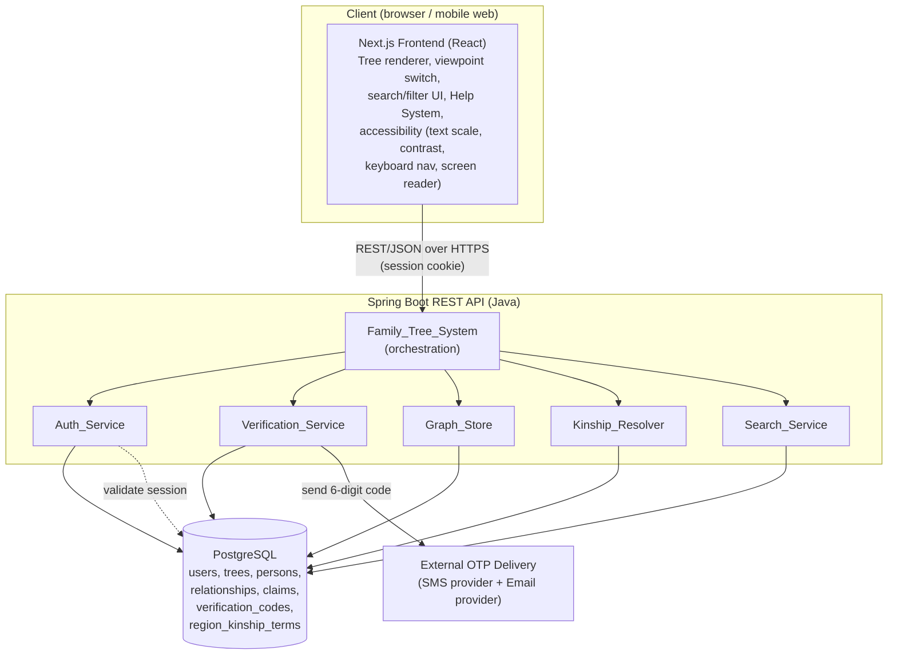
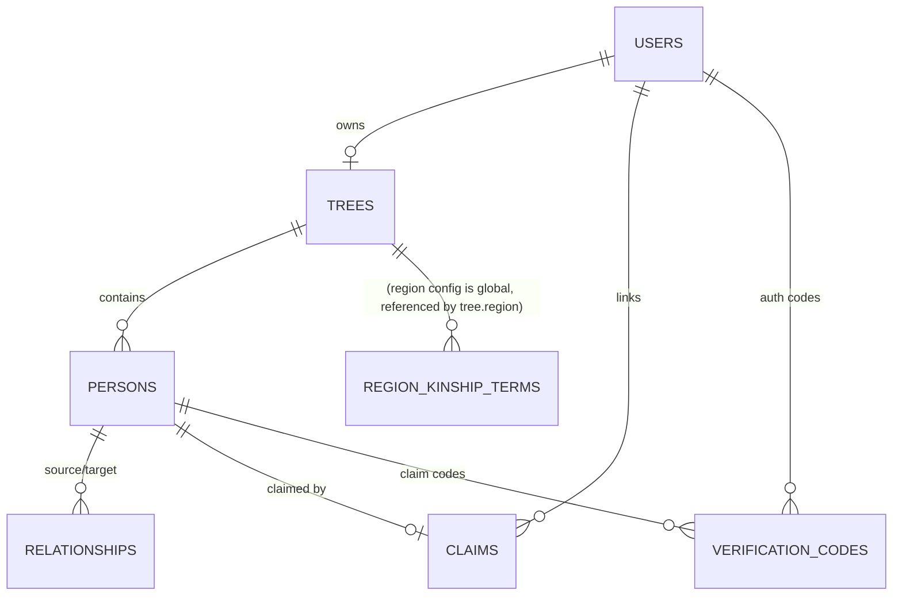
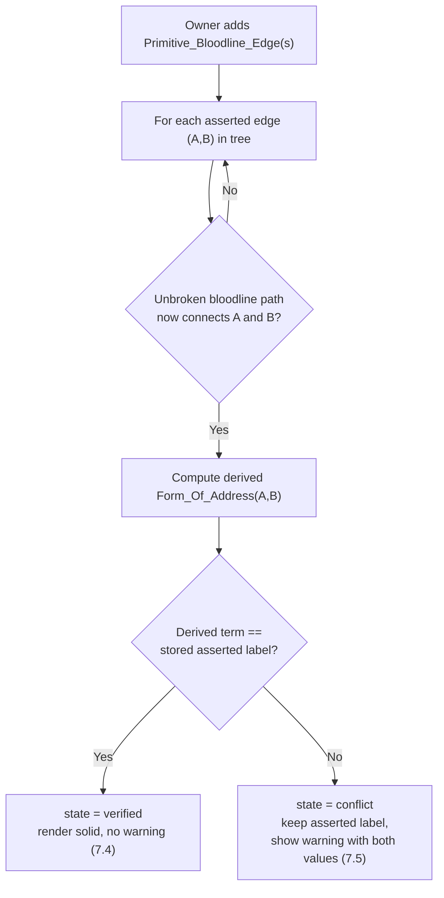

# Design Document: Vietnamese Family Tree (Cây Gia Phả)

## Overview

The Vietnamese Family Tree system lets a single user build, own, and visualize a clan as a
relationship graph, with the defining feature being automatic computation of the correct
Vietnamese form of address (cách xưng hô) between any two persons. Address computation accounts
for paternal-vs-maternal side, gender, birth order/age, and regional dialect (Bắc/Trung/Nam).

The system is built on the user-chosen stack:

- **Frontend — Next.js (React).** Renders the tree/graph, handles viewpoint switching, search and
  filter UI, the in-app help system, and accessibility features (scalable text, contrast,
  keyboard navigation, screen-reader support).
- **Backend — Spring Boot (Java).** Exposes a REST API and hosts the domain services:
  `Auth_Service`, `Verification_Service`, `Graph_Store`, `Kinship_Resolver`, `Search_Service`,
  and orchestration logic for `Family_Tree_System`.
- **Database — PostgreSQL.** Stores users, persons, typed relationship edges, trees, claims,
  verification codes, and the region-keyed kinship-term configuration.
- **External dependency — OTP delivery provider(s).** An SMS provider and an email provider
  deliver 6-digit one-time codes for sign-up, sign-in, and node claiming.

### Design Goals and Key Decisions

1. **Store primitives, derive everything else.** Only `Primitive_Bloodline_Edge` (father-child,
   mother-child) and `Marriage_Edge` participate in kinship derivation. All higher-order terms
   (bác, chú, cô, dì, cậu, cháu, anh, em, …) are computed on demand by the `Kinship_Resolver`
   from the stored primitive graph. This keeps the data model small and makes regional dialect a
   pure lookup concern. (Requirements 4, 5, 8, 9)
2. **Two relationship modes.** A precise primitive relationship renders as a SOLID line and is
   fully derivable; an `Asserted_Relationship` (a direct label like "this person is my bác")
   renders as a DASHED line and is treated as opaque until intermediate nodes complete a path.
   (Requirements 5, 6, 7)
3. **Graph in a relational DB.** A `persons` table holds nodes and a single `relationships` table
   holds typed edges discriminated by a `type` column. Database constraints enforce the
   at-most-one-father / at-most-one-mother rule; application logic plus a recursive check enforce
   acyclicity. (Requirement 4)
4. **Region as configuration data, not code.** Kinship terms live in a `region_kinship_terms`
   table keyed by `(region, canonical_relation)`. The resolver computes a canonical relation from
   a path, then looks up the term for the tree's region. Adding or correcting a dialect is a data
   change, not a code change. (Requirement 9)
5. **OTP-only authentication.** No passwords. Identity is proven by a 6-digit code delivered to a
   phone or email, with strict validity windows and attempt lockouts. Sessions last 30 days.
   (Requirements 1, 2, 11)

## Architecture

The system is a three-tier web application. The Next.js frontend talks to the Spring Boot REST
API over HTTPS; the API persists to PostgreSQL and calls the external OTP provider for code
delivery.



### Request Flow Summary

- **Authenticated requests** carry a session cookie. A Spring `OncePerRequestFilter` resolves the
  session to a `User`, loads the user's tree, and attaches an authorization context (owner vs
  linked claimed-node user vs neither) used by `Graph_Store` and the privacy filter.
- **Kinship computation** is read-only and runs against an in-memory projection of the tree's
  primitive graph loaded per request (or cached per tree, invalidated on edge mutation).
- **OTP delivery** is the only outbound integration. The `Verification_Service` writes a
  `verification_codes` row (storing a hash of the code) and asks the provider to deliver the
  plaintext code. Delivery is treated as a best-effort external dependency with timeouts.

### Layering

Each Spring Boot service is split into a controller (REST), a service (domain logic), and a
repository (Spring Data JPA / JDBC). The `Kinship_Resolver` is a pure domain service with no I/O
beyond reading the graph projection and the region term table, which makes it directly amenable
to property-based testing.

### Security Considerations

- **OTP brute-force protection**: codes are 6-digit numeric, single-use, hashed at rest, bound to
  a short validity window (300s auth / 900s claim), and locked after 5 failed attempts. Code
  generation uses a cryptographically secure RNG. Rate-limit code *requests* per identifier to
  prevent SMS/email flooding and enumeration. (1.4, 1.8, 2.7, 11.5)
- **Session security**: session tokens are random (≥128 bits), stored server-side, transmitted in
  an `HttpOnly`, `Secure`, `SameSite` cookie over HTTPS, and revocable on sign-out. The 30-day
  expiry is enforced server-side; expired/revoked sessions are rejected. (2.3, 2.8)
- **External OTP provider is a trust/availability dependency**: delivery is best-effort with
  timeouts; provider outages degrade sign-up/sign-in/claiming but must never persist a session or
  claim without a verified code. Treat provider responses as untrusted input.
- **Minimize unauthenticated surface**: only `/auth/signup`, `/auth/signin`, their `/verify`
  endpoints, and claim verification are reachable without a session; all of these are rate-limited.
  Every other endpoint requires an authenticated session, and all mutations additionally enforce
  the ownership / claimed-node authorization model (Property 18). Avoid leaking whether an
  identifier exists beyond what Requirement 2.4 mandates.
- **Privacy enforcement server-side**: sensitive-field filtering (Property 20) is applied in the
  API, never relying on the client to hide private fields.

## Components and Interfaces

All endpoints are under `/api/v1`. All mutating endpoints require an authenticated session and
enforce tree ownership (or claimed-node linkage). Responses are JSON. Error responses use the
envelope described in **Error Handling**.

### Auth_Service

Handles sign-up, sign-in, session lifecycle. (Requirements 1, 2, 13)

| Method | Path | Purpose |
|---|---|---|
| `POST` | `/auth/signup` | Create an unverified `User` for a phone/email; trigger code send. (1.1–1.3, 1.6, 1.7, 1.9) |
| `POST` | `/auth/signup/verify` | Submit code to verify a new account; on success create the user's single tree. (1.4, 1.8, 13.1) |
| `POST` | `/auth/signin` | Request a sign-in code for a verified identifier. (2.1, 2.4) |
| `POST` | `/auth/signin/verify` | Submit code; establish a 30-day session. (2.2, 2.3, 2.5–2.7) |
| `POST` | `/auth/signout` | Terminate the current session. (2.8) |

Key behaviors:
- Identifier validation: VN phone (`0` + 9 digits, or `+84` + 9 digits) or email (≤254 chars,
  `local-part@domain`). (1.1, 1.2, 1.7)
- Duplicate check has a 5-second budget; on timeout the account is created as unverified. (1.9)
- Verification attempt counter locks an account/request after 5 failures (900s for sign-up;
  invalidate issued code for sign-in). (1.8, 2.7)

### Verification_Service

Sends and validates one-time codes; manages node claiming. (Requirements 1, 2, 11)

| Method | Path | Purpose |
|---|---|---|
| `POST` | `/persons/{personId}/invite` | Owner invites a phone/email to claim a node (code valid 15 min). (11.1, 11.7) |
| `POST` | `/persons/{personId}/claim/verify` | Recipient submits code to claim the node. (11.2–11.5) |

Code rules: 6-digit numeric; hashed at rest; validity windows of 300s (auth) / 900s (15 min,
claiming); max 5 attempts; single active code per (purpose, target).

### Graph_Store

Persists `Person` nodes and typed `Relationship` edges; enforces structural invariants and
authorization. (Requirements 3, 4, 5, 6, 7, 12, 13, 14, 15)

| Method | Path | Purpose |
|---|---|---|
| `POST` | `/persons` | Create a person in the owner's tree. (3.1, 3.2, 3.6) |
| `PATCH` | `/persons/{id}` | Edit person fields (partial update). (3.3, 3.6, 11.6) |
| `GET` | `/persons/{id}` | Read a person with privacy filtering applied. (14.3–14.5) |
| `DELETE` | `/persons/{id}` | Begin deletion; returns the two-option choice (no mutation yet). (3.4, 15.1, 15.10) |
| `POST` | `/persons/{id}/delete` | Execute deletion with chosen strategy `cascade` or `preserve`. (15.3–15.9) |
| `POST` | `/relationships` | Create a typed edge (bloodline / marriage / non-bloodline / asserted). (4.x, 5.x, 6.x, 12.x) |
| `DELETE` | `/relationships/{id}` | Remove an edge (owner only). (13.4) |
| `PATCH` | `/persons/{id}/visibility` | Set per-field visibility (private/public). (14.1, 14.2) |

Key behaviors:
- Edge creation validates: distinct endpoints (4.2), referenced nodes exist (4.8, 5.5), at-most-one
  father/mother (4.4), no parent-child cycle (4.9), marital status enum (4.5), social type enum
  (12.1, 12.2), asserted label length 1–50 (6.1, 6.2).
- After creating bloodline edges, runs the **asserted-upgrade scan** (Requirement 7).
- Enforces authorization: only owner mutates; linked user may edit their claimed node. (13.4, 13.5, 11.6)

### Kinship_Resolver

Pure domain service computing `Form_Of_Address`. (Requirements 8, 9, 10) — detailed in its own
section below.

| Method | Path | Purpose |
|---|---|---|
| `GET` | `/trees/{treeId}/address?ego={egoId}&target={targetId}` | Address from ego to target. (8.1) |
| `GET` | `/trees/{treeId}/viewpoint/{egoId}/addresses` | Address from ego to every node. (10.1, 10.2) |
| `PATCH` | `/trees/{treeId}/region` | Change the tree's default region. (9.5, 9.6) |

### Search_Service

Name and address search plus combinable field filters. (Requirement 16)

| Method | Path | Purpose |
|---|---|---|
| `POST` | `/trees/{treeId}/search` | Body: `{ nameQuery?, addressQuery?, viewpointId?, filters? }`. (16.1–16.8) |

Filters: gender, side (paternal/maternal relative to viewpoint), birth-year range, death status,
claimed status, relationship type. Combined filters are intersected (AND). (16.3, 16.4)

### Help_System (frontend)

Static, in-app guide content served by Next.js. (Requirement 17) Exposes a help entry point from
the main interface and a section per required topic, reachable within the app and rendered within
2 seconds.

### Renderer & Accessibility (frontend)

Next.js renders solid (derived), dashed (asserted), and a third distinct style (non-bloodline)
edges, and implements the accessibility thresholds of Requirement 18.

## Data Models

### Relational representation of the graph

The graph is stored as a **node table** (`persons`) plus a single **typed-edge table**
(`relationships`) with a `type` discriminator column. This keeps all edge kinds queryable
uniformly while letting type-specific columns be nullable and validated by the application and by
partial constraints.



### `users`

| Column | Type | Notes |
|---|---|---|
| `id` | `uuid` PK | |
| `phone` | `text` unique nullable | VN format; unique among non-null |
| `email` | `text` unique nullable | ≤254 chars; unique among non-null |
| `verified` | `boolean` not null default false | (1.5) |
| `created_at` | `timestamptz` | |

Constraint: at least one of `phone`/`email` present. Partial unique indexes on `phone` and
`email` where not null.

### `sessions`

| Column | Type | Notes |
|---|---|---|
| `id` | `uuid` PK | opaque session token id (random, ≥128 bits) |
| `user_id` | `uuid` FK → users | |
| `created_at` | `timestamptz` | |
| `expires_at` | `timestamptz` | created_at + 30 days (2.3) |
| `revoked` | `boolean` default false | set on sign-out (2.8) |

### `trees`

| Column | Type | Notes |
|---|---|---|
| `id` | `uuid` PK | |
| `owner_user_id` | `uuid` FK → users, unique | exactly one tree per user (13.1, 13.2) |
| `region` | `text` not null default 'Bac' | one of {Bac, Trung, Nam} (9.1, 9.2, 9.6) |
| `created_at` | `timestamptz` | |

Region is stored ASCII-keyed (`Bac`/`Trung`/`Nam`) and displayed as Bắc/Trung/Nam.

### `persons`

| Column | Type | Notes |
|---|---|---|
| `id` | `uuid` PK | |
| `tree_id` | `uuid` FK → trees | (3.1) |
| `display_name` | `text` not null | 1–100 chars (3.2) |
| `gender` | `text` not null | enum {male, female} (3.2) |
| `birth_order` | `int` nullable | 1–99 (3.2) |
| `birth_year` | `int` nullable | 1000–current year (3.2) |
| `death_status` | `boolean` not null default false | (3.5) |
| `adoption_status` | `boolean` nullable | sensitive field (14.1) |
| `vis_marital` | `text` not null default 'private' | {private, public} (14.1, 14.2) |
| `vis_adoption` | `text` not null default 'private' | {private, public} |
| `vis_death` | `text` not null default 'private' | {private, public} |
| `created_at` | `timestamptz` | |

Marital status itself is a property of the `Marriage_Edge` (see below); `vis_marital` governs its
exposure in person responses.

### `relationships` (typed edges)

| Column | Type | Notes |
|---|---|---|
| `id` | `uuid` PK | |
| `tree_id` | `uuid` FK → trees | edges never cross trees |
| `type` | `text` not null | discriminator: {bloodline_father, bloodline_mother, marriage, non_bloodline, asserted} |
| `source_id` | `uuid` FK → persons | parent (bloodline), or one endpoint |
| `target_id` | `uuid` FK → persons | child (bloodline), or other endpoint |
| `marital_status` | `text` nullable | for marriage: {married, divorced, deceased} (4.5) |
| `social_type` | `text` nullable | for non_bloodline: {friend, teacher, colleague} (4.6, 12.1) |
| `asserted_label` | `text` nullable | for asserted: 1–50 chars (4.7, 6.1) |
| `derivation_state` | `text` not null default 'derived' | {derived, asserted, verified, conflict} (7.x) |
| `created_at` | `timestamptz` | |

Constraints and indexes:
- `CHECK (source_id <> target_id)` enforces no self-reference. (4.2)
- Partial unique index: `UNIQUE (target_id) WHERE type = 'bloodline_father'` → at most one father
  per child; same for `bloodline_mother`. (4.4)
- Type-conditional `CHECK` constraints: `marital_status` non-null iff `type='marriage'`;
  `social_type` non-null iff `type='non_bloodline'`; `asserted_label` non-null iff
  `type='asserted'`.
- Indexes on `(tree_id, type)`, `(source_id)`, `(target_id)` for traversal and search.
- **Cycle prevention** (4.9): bloodline edges are directed parent→child. Before inserting a
  bloodline edge `(p, c)`, the `Graph_Store` runs a recursive reachability check (recursive CTE
  over bloodline edges, or in-memory ancestor walk) to reject the edge if `p` is reachable from
  `c` (i.e., `c` is an ancestor of `p`).

### `claims`

| Column | Type | Notes |
|---|---|---|
| `id` | `uuid` PK | |
| `person_id` | `uuid` FK → persons, unique | a node is claimed by at most one user (11.2) |
| `user_id` | `uuid` FK → users | linked user (11.2, 11.6) |
| `claimed_at` | `timestamptz` | |

`Person` vs `User`: a `Person` is a graph node that may or may not correspond to a login account;
a `Claimed_Node` is a `Person` linked to a `User` via a `claims` row. Editing a claimed node is
permitted to the linked user and the tree owner. (11.6, 13.4)

### `verification_codes`

| Column | Type | Notes |
|---|---|---|
| `id` | `uuid` PK | |
| `purpose` | `text` not null | {signup, signin, claim} |
| `user_id` | `uuid` nullable | for signup/signin |
| `person_id` | `uuid` nullable | for claim invitations |
| `destination` | `text` not null | phone or email the code was sent to |
| `code_hash` | `text` not null | hash of the 6-digit code (never stored in plaintext) |
| `issued_at` | `timestamptz` not null | |
| `expires_at` | `timestamptz` not null | issued_at + 300s or + 900s (15 min) |
| `attempts` | `int` not null default 0 | failed attempts (lockout at 5) |
| `consumed` | `boolean` not null default false | single-use |

### `region_kinship_terms` (configuration data layer)

Maps a canonical kinship relation to a dialect term. (Requirement 9)

| Column | Type | Notes |
|---|---|---|
| `region` | `text` not null | {Bac, Trung, Nam} (9.1) |
| `canonical_relation` | `text` not null | canonical key produced by the resolver (see below) |
| `term` | `text` not null | e.g. ông, bà, bác, chú, cô, dì, cậu, anh, chị, em, cháu |

Primary key `(region, canonical_relation)`. The resolver derives a `canonical_relation` from a
path, then reads `term` for the tree's region. A missing row means "undefined for this region".
(9.4) The **regional coverage property** (9.7) is enforced as data: every canonical relation
present for any region must be present for all three regions; this is validated by a test
(Property 9) and a data-integrity check.

## Kinship_Resolver Algorithm

The resolver answers: *from the viewpoint (ego), what term does ego use to address the target?*
It operates only on `Derived_Relationships` — `Primitive_Bloodline_Edge` (father-child,
mother-child) and `Marriage_Edge`. `Non_Bloodline_Relation` and `Asserted_Relationship` edges are
excluded from all path computation (12.3, 6.4).

### Step 1 — Build the kinship graph projection

Load the tree's bloodline and marriage edges into an in-memory graph:
- Bloodline edges create child↔parent adjacency, each tagged with `parentType` (father/mother),
  which carries the **side** (father→paternal, mother→maternal) and direction (up = toward
  parent/ancestor, down = toward child/descendant).
- Marriage edges create a spouse adjacency (undirected), tagged `spouse`.

### Step 2 — Find the kinship path (BFS / shortest path)

Run BFS from `ego` to `target` over the projection. BFS gives the shortest kinship path, which
corresponds to the closest (most specific) kinship relation. Each path is a sequence of typed
steps: `up-father`, `up-mother`, `down-child`, `spouse`. If no path exists, return the
**unresolved** indicator. (8.7, 10.3)

To resolve via blood ancestry, the canonical pattern is: walk **up** from ego to a common ancestor
(or connecting node), then **down** to target, with optional `spouse` hops at endpoints (e.g.,
the target is the spouse of a blood relative).

### Step 3 — Derive the canonical relation

Reduce the path to a canonical relation descriptor capturing exactly the facts that determine the
Vietnamese term:

```
CanonicalRelation {
  upCount:   int     // generations up from ego to the meeting node
  downCount: int     // generations down from meeting node to target
  side:      PATERNAL | MATERNAL | SELF   // side of the branch that leaves ego's lineage
  targetGender: MALE | FEMALE
  // birth-order comparison of the two siblings at the branch point
  branchOrder: ELDER | YOUNGER | SELF | UNKNOWN
  spouseHop: boolean // target reached via a marriage edge at the end
}
```

- **Side** (8.3): determined by whether the step leaving ego's direct lineage toward the target's
  branch is via a father link (paternal) or a mother link (maternal). Paternal uncles use
  bác/chú; the maternal uncle uses cậu.
- **Elder/younger** (8.4, 8.5): at the generation where ego's ancestor and the target's ancestor
  are siblings, compare their birth order; if birth order is absent, fall back to birth year. If
  both are absent or equal, set `branchOrder = UNKNOWN`, which forces an **unresolved** result for
  terms that require the distinction (bác vs chú; anh/chị vs em). (8.5)
- **Generation distance** (`upCount`, `downCount`) selects the generational band
  (ông/bà grandparent, bác/chú/cô/dì/cậu parent's generation, anh/chị/em same generation,
  cháu descendant, etc.).

### Step 4 — Look up the regional term

Form the `canonical_relation` key string from the descriptor (a stable encoding of upCount,
downCount, side, targetGender, branchOrder, spouseHop) and query
`region_kinship_terms (region = tree.region, canonical_relation = key)`. Return the `term` if
present; otherwise return **undefined for this region**. (9.3, 9.4)

### Symmetry (8.6)

For any pair connected solely by derived relationships, if ego addresses target with a descendant
term (cháu), then target addresses ego with the corresponding ascendant term (bác/chú/cô/dì/cậu).
This is guaranteed structurally because reversing the path swaps `upCount`/`downCount` and the
canonical key for the reversed path maps to the inverse term in the region table. It is validated
as **Property: symmetry** below.

### Performance (8.1, 10.2)

Single-pair resolution is bounded by BFS over the tree (≤1,000 nodes), well within 1s. For
viewpoint switching, the resolver runs a single BFS from ego to all nodes (one traversal) and
derives each target's canonical relation from the BFS tree, returning all addresses within 2s for
1,000 nodes. The graph projection may be cached per tree and invalidated on any edge mutation.

## Asserted vs Derived Relationships

### Storage and rendering

- **Derived** edges (`type` in {bloodline_*, marriage}) have `derivation_state = 'derived'` and
  render as **solid** lines. (5.3)
- **Asserted** edges (`type = 'asserted'`) have `derivation_state = 'asserted'` and a stored
  `asserted_label`; they render as **dashed** lines, visually distinct from derived and from
  non-bloodline edges. (6.3, 12.4)
- While a relationship is asserted, the resolver returns the stored label as the address and never
  traverses the asserted edge to derive other addresses. (6.4)

### Upgrade and conflict-detection flow (Requirement 7)

When the owner adds bloodline edges, `Graph_Store` runs an **upgrade scan**:



- A path "completing" means an unbroken chain of `Primitive_Bloodline_Edge`s now joins the two
  endpoints. (7.1)
- On match → `verified`, render solid within 1s, no warning. (7.2, 7.3, 7.4)
- On mismatch → `conflict`, retain the asserted label unchanged, surface a warning showing both the
  asserted label and the derived term until the owner resolves it. (7.5)

### Neighbor preservation produces asserted edges (Requirement 15)

When a node is deleted with **neighbor preservation**, for each pair of neighbors (A, B) whose only
derived path to each other ran through the deleted node, the system creates an
`Asserted_Relationship` labeled with the address the resolver computed between A and B
*immediately before* deletion (15.5). Such created edges are subject to the same upgrade/conflict
flow if later completed by bloodline edges (15.9).

## Node Deletion Cascade Choice (Requirement 15)

Deletion is a two-phase operation: a `DELETE` returns the choice prompt and mutates nothing
(15.1, 15.2); a subsequent `POST /persons/{id}/delete` with a chosen strategy executes atomically
in a transaction.

### Cascade deletion (15.3)

1. Remove the target node and all its edges.
2. Repeatedly remove any other node that has **zero** edges as a result, until no node that became
   edgeless through this operation remains (transitive orphan removal).

Implementation: after removing the target, do a worklist sweep — a node is removed only if it
became edgeless due to this cascade (not nodes that were already isolated independently). Iterate
until the worklist is empty.

### Neighbor preservation (15.4, 15.5, 15.7, 15.8)

1. **Before** removing anything, compute the pre-deletion address for every relevant neighbor pair.
2. Remove the target node and its edges.
3. Retain all former neighbors (even if they become isolated — 15.8).
4. For each pair (A, B) that were each connected to the target by a derived relationship and whose
   **only** derived path to each other passed through the target, create an asserted edge labeled
   with the pre-deletion address — **but only if** that address was defined (skip undefined pairs,
   15.7).

"Only derived path passed through target" is checked by testing whether A and B remain connected
by derived edges in the graph with the target removed; if not connected, the target was a cut node
for that pair and an asserted edge is created.

## Correctness Properties

*A property is a characteristic or behavior that should hold true across all valid executions of a
system — essentially, a formal statement about what the system should do. Properties serve as the
bridge between human-readable specifications and machine-verifiable correctness guarantees.*

The properties below were derived from the acceptance criteria via prework analysis and
deduplication. They are grouped by domain area. Each is universally quantified and intended to be
validated by a single property-based test running ≥100 iterations.

### Authentication and Verification

### Property 1: Code validity window

*For any* issue time and check time, a verification code is accepted as valid **if and only if**
the check time is within the code's validity window after issue (300s for sign-up/sign-in, 900s
for node claiming) and the code has not been consumed.

**Validates: Requirements 1.4, 2.2, 2.6, 11.4**

### Property 2: Attempt lockout

*For any* sequence of verification attempts, after exactly 5 non-matching submissions for the same
account/sign-in request/invitation, every subsequent submission is rejected (and the issued code
invalidated / locked for its lockout window).

**Validates: Requirements 1.8, 2.7, 11.5**

### Property 3: Identifier validation

*For any* string submitted as an identifier, sign-up is accepted **if and only if** the string is
a valid Vietnamese phone number (10 digits beginning with 0, or +84 followed by 9 digits) or a
valid email (≤254 chars, `local-part@domain`); invalid identifiers are rejected with the offending
field identified and no account created.

**Validates: Requirements 1.1, 1.2, 1.7**

### Person and Relationship Storage

### Property 4: Person field-bounds validation

*For any* generated set of person field values, a create/edit request is accepted **if and only if**
the display name is 1–100 chars, gender ∈ {male, female}, birth order (if present) ∈ 1–99, and
birth year (if present) ∈ 1000–current year; rejected requests leave the target node unchanged and
identify the invalid field.

**Validates: Requirements 3.2, 3.6**

### Property 5: Person create/edit round-trip and partial update

*For any* valid person and *any* subset of fields to edit, reading the person after create or edit
returns exactly the stored values, with edited fields updated and all unspecified fields unchanged.

**Validates: Requirements 3.1, 3.3**

### Property 6: No self-referencing edge

*For any* person and *any* edge type, a create-relationship request whose source and target are the
same person is rejected.

**Validates: Requirements 4.1, 4.2**

### Property 7: At-most-one father and one mother

*For any* sequence of bloodline-edge insertions, every child node ends with at most one
father-child edge and at most one mother-child edge; a second father (or mother) edge for the same
child is rejected.

**Validates: Requirements 4.4**

### Property 8: Bloodline acyclicity

*For any* acyclic set of bloodline edges and *any* candidate bloodline edge, the candidate is
rejected **if and only if** adding it would create a parent-child cycle; the stored bloodline edge
set is always acyclic.

**Validates: Requirements 4.9**

### Property 9: Asserted-label validation

*For any* candidate label, an add-asserted-relationship request is accepted **if and only if** the
label length is 1–50 characters; accepted requests create an asserted edge linking exactly the two
specified nodes with that label, and rejected requests create nothing.

**Validates: Requirements 4.7, 6.1, 6.2**

### Kinship Resolution

### Property 10: Resolver totality

*For any* tree graph and *any* ordered pair (ego, target), the `Kinship_Resolver` returns either a
defined `Form_Of_Address` term or the explicit unresolved indicator — never an error or undefined
crash.

**Validates: Requirements 5.4, 8.7, 10.1, 10.3**

### Property 11: Side selection

*For any* parent-sibling kinship structure, the resolver selects a paternal-side term (bác/chú) when
the connecting branch leaves ego's lineage through a father link, and the maternal term cậu when it
leaves through a mother link.

**Validates: Requirements 8.2, 8.3**

### Property 12: Elder/younger selection

*For any* sibling pair at a branch point, the resolver selects the elder-sibling term when the
relative was born before the connecting parent and the younger-sibling term when born after (using
birth order, falling back to birth year); when both birth order and birth year are absent or equal,
the resolver returns the unresolved indicator and selects neither term.

**Validates: Requirements 8.4, 8.5**

### Property 13: Address symmetry

*For any* pair of nodes connected solely by derived relationships, if ego addresses target with a
descendant term (such as cháu), then target addresses ego with the corresponding ascendant term
(bác/chú/cô/dì/cậu), per the inverse-term mapping.

**Validates: Requirements 8.6**

### Property 14: Non-derived edges excluded from path computation

*For any* tree graph, adding arbitrary `Non_Bloodline_Relation` or `Asserted_Relationship` edges
does not change any computed `Form_Of_Address` or derived connectivity between nodes; for an
asserted pair the resolver returns the stored asserted label and never traverses the asserted edge.

**Validates: Requirements 6.4, 12.3**

### Regional Dialect

### Property 15: Region term selection

*For any* canonical kinship relation, the resolver returns the term configured for the tree's
current region, and after the region is changed it returns the term configured for the new region.

**Validates: Requirements 9.3, 9.5**

### Property 16: Regional coverage

*For all* canonical relations that resolve to a defined term under any region in {Bắc, Trung, Nam},
the relation resolves to a defined term under every region in the set.

**Validates: Requirements 9.7**

### Upgrade, Authorization, and Privacy

### Property 17: Asserted-relationship upgrade and conflict detection

*For any* asserted pair that becomes joined by an unbroken bloodline path, the relationship is
upgraded: when the newly derived `Form_Of_Address` equals the stored asserted label it is marked
verified with no warning, and when it differs it is marked conflict, the asserted label is retained
unchanged, and a warning exposes both values.

**Validates: Requirements 7.1, 7.4, 7.5, 15.9**

### Property 18: Mutation authorization

*For any* user and *any* create/edit/delete operation, the operation is permitted **if and only if**
the user is the tree owner, or the user is the linked `Claimed_Node` user editing their own node;
all other mutations are rejected with the tree contents unchanged.

**Validates: Requirements 11.6, 13.4, 13.5**

### Property 19: At most one tree per user

*For any* sequence of verification/tree-creation events for a single user, the user owns exactly one
tree (never more).

**Validates: Requirements 13.2**

### Property 20: Sensitive-field privacy filter

*For any* person with arbitrary per-field visibility settings and *any* requesting viewer, the
response includes each private sensitive field **if and only if** the viewer is the tree owner or
the linked `Claimed_Node` user, while every non-private field is always included.

**Validates: Requirements 14.3, 14.4, 14.5**

### Deletion

### Property 21: Cascade deletion transitive orphan removal

*For any* tree graph, after cascade-deleting a target node, the target and all its edges are removed,
every node that became edgeless as a result of the cascade is removed (transitively), and nodes that
were already isolated before the operation are retained.

**Validates: Requirements 15.3**

### Property 22: Neighbor preservation

*For any* tree graph, after neighbor-preservation deletion of a target node, every former neighbor is
retained (even if isolated), and an `Asserted_Relationship` labeled with the pre-deletion computed
address is created **exactly for** each neighbor pair whose only derived path ran through the target
**and** whose pre-deletion address was defined (and for no other pair).

**Validates: Requirements 15.4, 15.5, 15.7, 15.8**

### Search

### Property 23: Name search is normalized-substring exact

*For any* query and set of person names, name search returns all and only the persons whose
case-folded, diacritic-stripped display name contains the case-folded, diacritic-stripped query as a
substring.

**Validates: Requirements 16.1**

### Property 24: Address search exact match

*For any* tree, viewpoint, and query term, address search returns all and only the persons whose
computed `Form_Of_Address` from the viewpoint equals the query term.

**Validates: Requirements 16.2**

### Property 25: Filter combination is intersection and monotone

*For any* set of applied filters, the result equals the intersection of the per-filter result sets,
and is therefore a subset of the result returned when any one filter is removed.

**Validates: Requirements 16.4, 16.5**

## Error Handling

The API uses a single JSON error envelope so the Next.js frontend can present consistent,
accessible messages:

```json
{ "error": { "code": "VALIDATION_ERROR", "field": "phone", "message": "Invalid Vietnamese phone number." } }
```

| Category | HTTP | Code(s) | Behavior |
|---|---|---|---|
| Validation | 400 | `VALIDATION_ERROR` | Field-level rejection; offending field named; no mutation. (1.7, 3.6, 4.2, 6.2, 9.6, 12.2, 16.8) |
| Duplicate identifier | 409 | `IDENTIFIER_TAKEN` | Sign-up rejected; identifier-already-registered message. (1.6) |
| Duplicate-check timeout | 201 | — | Fallback: create account unverified (not an error). (1.9) |
| Authentication | 401 | `ACCOUNT_NOT_FOUND`, `CODE_INVALID`, `CODE_EXPIRED` | Sign-in/claim failures; existing session unchanged on wrong code. (2.4–2.6, 11.3, 11.4) |
| Lockout | 429 | `TOO_MANY_ATTEMPTS` | After 5 failures; lockout window enforced. (1.8, 2.7, 11.5) |
| Authorization | 403 | `NOT_AUTHORIZED` | Non-owner / non-linked mutation rejected; contents unchanged. (13.5) |
| Not found / not accessible | 404 | `NODE_NOT_ACCESSIBLE`, `MISSING_NODE` | Target/referenced node not in tree. (3.7, 4.8, 5.5, 10.4, 15.10) |
| Structural constraint | 409 | `SELF_REFERENCE`, `CYCLE_VIOLATION`, `PARENT_LIMIT`, `ALREADY_CLAIMED` | Graph invariant violations. (4.2, 4.4, 4.9, 11.7) |
| Unresolved kinship | 200 | `UNRESOLVED` | Not an error; explicit indicator in resolver/search responses. (8.5, 8.7, 9.4, 10.3) |
| Conflict | 200 | `CONFLICT` | Upgrade mismatch; warning payload carries both labels; state preserved. (7.5) |

Principles:
- **Atomicity**: every mutation (especially edge creation with upgrade scan, and the two deletion
  strategies) runs in a single transaction; on any failure nothing is persisted, satisfying the
  "leave unchanged" criteria throughout.
- **Totality over exceptions**: the `Kinship_Resolver` returns an `UNRESOLVED`/`UNDEFINED_REGION`
  indicator rather than throwing, so unresolved paths never crash a viewpoint render. (8.7, 9.4)
- **External-dependency failures**: OTP send failures (provider down/timeout) return a retryable
  error to the client and do not leave a half-created session; codes are issued only after the row
  is persisted.

## Testing Strategy

A dual approach: example/integration tests for concrete scenarios and infrastructure, and
property-based tests for the universal invariants above. Property-based testing is highly
applicable here because the `Kinship_Resolver`, search filters, validation, and graph operations
are pure functions over large structured input spaces.

### Property-Based Testing

- **Library**: jqwik (JUnit 5 property-based testing for Java) for the Spring Boot domain layer;
  fast-check for any frontend pure logic (e.g., diacritic-insensitive normalization shared in TS).
  Do not hand-roll generators frameworks.
- **Iterations**: each property test runs a minimum of 100 generated cases.
- **Tagging**: each property test is tagged with a comment referencing its design property in the
  form **Feature: vietnamese-family-tree, Property {number}: {property_text}**.
- **One test per property**: each of Properties 1–25 is implemented by a single property-based test.
- **Generators**: custom generators produce random tree graphs (DAGs of bloodline edges + marriage
  + non-bloodline + asserted edges), random persons (with/without birth order/year, diacritics in
  names), random region tables, random viewpoints, and random viewer/authorization contexts.
- **Highest-value properties to prioritize**: symmetry (Property 13), regional coverage
  (Property 16), and filter-monotonicity (Property 25), plus bloodline acyclicity (Property 8) and
  neighbor-preservation (Property 22).
- **Mocks**: the OTP provider and persistence are mocked/in-memory for resolver, validation, and
  graph properties so 100+ iterations are cheap and deterministic.

### Unit (Example) Tests

Concrete scenarios and state transitions: account marked unverified (1.5), 30-day session creation
(2.3), sign-out (2.8), death-status boolean (3.5), bloodline type/direction (4.3), marital/social
enums (4.5, 4.6), storage mappings and edge styles (5.1–5.3, 6.3, 12.4, 15.6), claim transitions
(11.2, 11.3), tree creation (13.1), visibility storage/default (14.1, 14.2), deletion prompt gating
(15.1, 15.2), filter capability coverage (16.3), and help content coverage (17.1, 17.2, 17.4, 17.5).

### Edge-Case Tests

Covered explicitly and folded into property generators: duplicate-check timeout fallback (1.9),
nonexistent-node operations (3.7, 4.8, 5.5, 10.4, 15.10), unresolved kinship inputs (8.5),
undefined-region lookups (9.4), invalid region (9.6), already-claimed invitation (11.7), invalid
non-bloodline inputs (12.2), tree-creation failure (13.3), no-match search (16.6), and invalid
query/range (16.8).

### Integration Tests (1–3 examples each)

External and infrastructure behavior not suited to PBT: OTP code delivery and timing (1.3, 2.1,
11.1) against a mocked SMS/email provider; end-to-end sign-up→verify→tree-creation; and claim flow.

### Performance Tests

Benchmarks against a generated 1,000-node tree: single-pair address < 1s (8.1), viewpoint
all-addresses < 2s (10.2), search < 2s (16.7), help render < 2s (17.3), and asserted-upgrade render
< 1s (7.2).

### Accessibility Tests (Requirement 18)

Automated audits (e.g., axe-core) for programmatic name/role/value (18.5) and contrast (18.3);
layout assertions for touch-target size (18.4) and text scaling 100–200% without content loss
(18.1, 18.2); keyboard-traversal tests for full reachability (18.6). As noted in the requirements,
full conformance additionally requires manual screen-reader testing and expert review; automated
checks verify the machine-verifiable thresholds only.

## Privacy, Sharing, Photos, and Compliance (Requirements 19–25)

This section extends the existing authorization and privacy model (Requirements 13, 14) with
tree-level read control, living-person protection, broader field visibility, data-subject rights,
consent capture, person photos, and abuse/audit controls. It builds on the existing
`AuthorizationService` (owner / linked-claimed-user / neither classification), the server-side
`PersonResponse` privacy filter, and the `AuthenticationFilter` that binds an `AuthContext` per
request.

### Read-authorization model (Requirement 19, 20)

Today reads are gated only at the field level; tree-level read access is not enforced. The design
closes this:

- A new `ReadAuthorizationService` (or an extension of `AuthorizationService`) computes a
  `ReadAccess` decision for `(viewer, tree, shareToken)`:
  - **private** → allow only `OWNER` or `LINKED_CLAIMED_USER`.
  - **link** → additionally allow a requester presenting a valid, non-revoked share token.
  - **public** → allow any authenticated user.
- Every read endpoint (`GET /persons/{id}`, the tree view, search, viewpoint addresses, photo
  serving) calls `requireReadAccess(treeId, shareToken)` before returning data. Denials return a
  uniform `NOT_AUTHORIZED` (403) that does not reveal tree existence (19.7, 25.4). This requires
  adding the gate to endpoints that currently only call `classify` (notably `PersonController.read`,
  which performs no authentication check today).
- A request carries the optional share token via header `X-Share-Token` or a path/query parameter on
  the share-link route; the token is matched against `tree_share_tokens` (hashed at rest).
- **Living-person redaction** is a viewer-dependent projection applied after read access is granted.
  `Person` gains no living flag column; "living" is derived: `death_status = false` AND
  (`birth_year` is null OR `birth_year > currentYear - 100`). When the viewer is non-privileged and
  the tree's `living_redaction` is enabled, the projection drops birth year/order and replaces the
  display name with a placeholder (e.g. "Người thân còn sống" / "Living relative"), unless the
  corresponding field visibility is `public`. Node identity and edges are still returned so the
  graph renders (20.5).
- **Search and viewpoint reads.** The viewpoint all-addresses response carries only person ids and
  kinship descriptors (no names or birth years), so it exposes no identifying fields. Search results
  do carry display names, so a `SearchResultRedactor` applies the same name redaction after the
  query runs: for a non-privileged viewer it replaces living / `vis_name`-private names with the
  placeholder, and drops such persons entirely from a *name* query so a hidden name cannot be
  discovered by searching for it (name-enumeration protection).

### Extended field visibility (Requirement 21)

The proven per-field mechanism (`vis_marital` / `vis_adoption` / `vis_death`) is generalized with
`vis_name`, `vis_birth_year`, and `vis_photo` columns. Display name and birth year default to
`public` (a shared genealogy should be usable, and living individuals are already protected by
Requirement 20's redaction); the more sensitive primary photo defaults to `private`. The
`PersonResponse` projection is extended so that, for a non-privileged viewer, a `private` `vis_name` yields the
placeholder, a `private` `vis_birth_year` omits the year, and a `private` `vis_photo` omits the
primary-photo reference. Privileged viewers (owner / linked user) always see all fields (matches the
existing `forPrivilegedViewer` path). Living-person redaction and per-field `private` settings
compose by union (a field hidden by either rule is hidden).

### Data-subject rights (Requirement 22)

- `GET /me/nodes/{personId}/export` — the linked user of a claimed node downloads a JSON export of
  the node's stored fields plus directly-incident edges.
- Correction reuses the existing `PATCH /persons/{id}` path already permitted to the linked user.
- `POST /me/nodes/{personId}/erase` with `{ "strategy": "delete" | "anonymize" }` — `delete` reuses
  the Requirement 15 two-phase deletion; `anonymize` overwrites identifying fields with neutral
  placeholders and detaches the claim. The request is recorded in the audit log.
- `DELETE /me/account` — deletes/anonymizes the user, cascades the owned tree (persons, edges,
  images), and revokes sessions, in one transaction.

### Terms of Service and consent (Requirement 23)

- Static ToS and Privacy Policy pages served by Next.js, reachable without auth.
- `legal_documents` holds the current version per document; `user_consents` records
  `(user_id, document, version, accepted_at)`.
- Sign-up verification requires an `acceptedTos`/`acceptedPrivacy` acknowledgement; the
  `AuthService.verifySignUp` flow records consent at the same point it creates the tree, and refuses
  account creation without it (23.2, 23.3). A version bump forces re-acceptance, enforced as a
  pre-mutation check in the authorization layer (23.4).

### Person photos (Requirement 24)

- **Object storage**, not the database. Local/dev uses **MinIO** (S3-compatible) via Docker Compose;
  production uses any S3-compatible bucket. A `StorageService` abstracts `put`/`get`/`delete` and
  signed-URL issuance behind an interface so the backend is cloud-agnostic.
- New `person_photos` table: `id`, `person_id` (FK, indexed), `object_key`, `content_type`,
  `width`, `height`, `byte_size`, `is_primary` (at most one true per person), `created_at`. Binary
  bytes never enter Postgres (24.7).
- Upload pipeline: validate content-type (JPEG/PNG/WebP) and size; **re-encode and strip EXIF/GPS
  metadata** before persisting (24.4); reject anything else (24.3). Re-encoding also neutralizes
  polyglot/malicious payloads.
- Serving: `GET /persons/{id}/photos/{photoId}` streams via the backend (or a short-lived signed
  URL) only after `requireReadAccess` and the `vis_photo` / living-person checks pass (24.5). The
  bucket is never public.
- Deletion: deleting a person (or erasing via 22.3) deletes its photo objects (24.6).

### Abuse prevention and audit (Requirement 25)

- A `RateLimiter` (per-identifier and per-IP token bucket; in-memory for single-node, pluggable to a
  shared store) guards verification-code issuance; over-threshold returns `429 TOO_MANY_ATTEMPTS`
  without revealing identifier existence (25.1). This complements existing OTP brute-force controls.
- An `audit_log` table records `actor_user_id`, `action`, `target_type`, `target_id`, `created_at`,
  and a redacted `detail` for authentication events, sharing/visibility changes, data-rights
  operations, and deletions (25.2). Codes, session tokens, and share tokens are never written in
  plaintext (25.3).

### Data model additions

- **`trees`** (new columns): `sharing` text not null default `'private'` ({private, link, public});
  `living_redaction` boolean not null default true.
- **`tree_share_tokens`**: `id`, `tree_id` (FK), `token_hash`, `created_at`, `revoked_at` nullable.
- **`persons`** (new columns): `vis_name`, `vis_birth_year`, `vis_photo` text not null default
  `'private'`.
- **`person_photos`**: as described above.
- **`legal_documents`**, **`user_consents`**, **`audit_log`**: as described above.

All new columns/tables are introduced via forward Flyway migrations (next is `V5`), preserving the
existing checksum history.

### API additions

| Method | Path | Purpose |
|---|---|---|
| `PATCH` | `/trees/{treeId}/sharing` | Owner sets sharing mode private/link/public. (19.1, 19.8) |
| `POST` | `/trees/{treeId}/share-token` | Owner generates a share token. (19.5) |
| `DELETE` | `/trees/{treeId}/share-token` | Owner revokes the share token. (19.5) |
| `PATCH` | `/trees/{treeId}/living-redaction` | Owner toggles living-person redaction. (20.4) |
| `PATCH` | `/persons/{id}/visibility` | Extended to `vis_name`/`vis_birth_year`/`vis_photo`. (21.5) |
| `POST` | `/persons/{id}/photos` | Upload an image (multipart). (24.1, 24.3, 24.4) |
| `PATCH` | `/persons/{id}/photos/{photoId}/primary` | Set the primary photo. (24.2) |
| `GET` | `/persons/{id}/photos/{photoId}` | Stream an image, access-gated. (24.5) |
| `DELETE` | `/persons/{id}/photos/{photoId}` | Delete an image. (24.6, 24.8) |
| `GET` | `/me/nodes/{personId}/export` | Data export for the linked user. (22.1) |
| `POST` | `/me/nodes/{personId}/erase` | Delete or anonymize own node. (22.3) |
| `DELETE` | `/me/account` | Delete own account and owned tree. (22.4) |
| `GET` | `/legal/tos`, `/legal/privacy` | Public legal documents. (23.1) |

### New Correctness Properties (26–31)

Each is implemented by a single property-based test (jqwik), extending the "one test per property"
convention and running ≥100 generated cases.

### Property 26: Tree read-access enforcement

*For any* tree sharing mode, viewer role, and optional share token, a read of the tree's nodes/edges
is permitted **if and only if** the (mode, role, token-validity) triple is one of the allowed
combinations of Requirement 19 (private→owner/linked; link→owner/linked/valid-token; public→any
authenticated), and a denied read returns no node or edge data.

**Validates: Requirements 19.3, 19.4, 19.6, 19.7**

### Property 27: Living-person redaction

*For any* person and viewer, when redaction is enabled and the viewer is non-privileged, the
person's birth year/order are omitted and the name is the placeholder **iff** the person is a
Living_Person (per the derived rule) and the respective field visibility is not `public`; a
not-living person is never redacted by this rule.

**Validates: Requirements 20.1, 20.2, 20.3**

### Property 28: Extended field-visibility filter

*For any* person with arbitrary `vis_name`/`vis_birth_year`/`vis_photo` settings and *any* viewer, a
governed field is included **iff** the viewer is privileged or that field's visibility is `public`;
a `private` name is replaced by the placeholder for non-privileged viewers.

**Validates: Requirements 21.3, 21.4**

### Property 29: Data-rights subject-only access

*For any* requester and target node/account, a data-rights export/erase/account-deletion succeeds
**iff** the requester is the data subject (the linked user of the claimed node, or the account
owner); otherwise it is rejected with no change.

**Validates: Requirements 22.1, 22.3, 22.4, 22.5**

### Property 30: Consent gate at sign-up

*For any* sign-up verification, the account and tree are created **iff** valid current-version ToS
and Privacy consents are supplied; absent or stale consent creates nothing (and forces
re-acceptance before the next mutation).

**Validates: Requirements 23.2, 23.3, 23.4**

### Property 31: Photo upload validation and metadata stripping

*For any* uploaded file, it is stored **iff** its type is JPEG/PNG/WebP and its size is within the
limit; a stored image contains no EXIF/geolocation metadata, and at most one photo per person is
marked primary.

**Validates: Requirements 24.1, 24.2, 24.3, 24.4**
