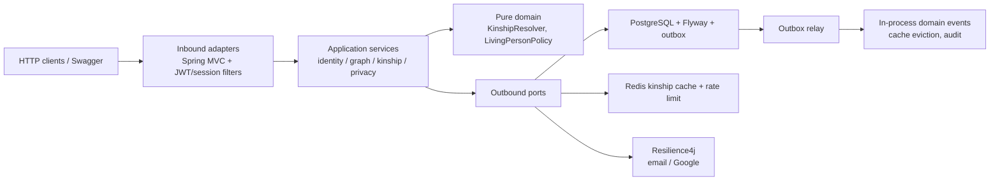

# ADR 0001: Modular hexagonal monolith for the Java portfolio API

Date: 2026-09-19

Status: Accepted

## Context

The production-priority request path is Next.js 14 + Drizzle + PostgreSQL.
The Java module was a disabled reference backend. For a Middle Backend
Developer portfolio, the Java API must be **runnable**, **coherent**, and
aligned with 2025-2026 job listings in Vietnam (ITviec / CareerViet / Joboko)
and internationally (Java 21, Spring Boot 3, hexagonal ports, Redis, Kafka-style
events, Testcontainers).

A full microservice split (identity / graph / kinship / privacy as separate
deployables plus Kafka) would over-fragment a single-product domain and fight
the existing transactional graph invariants (at-most-one parent, acyclicity,
asserted-vs-derived upgrades).

## Decision

Ship a **modular hexagonal monolith**:

Bounded contexts stay in-process and share one Postgres schema:

| Context | Responsibility | Persistence |
|---|---|---|
| Identity | Sessions, JWT for API clients, consent | `users`, `sessions` |
| Family graph | Persons, primitive edges only | `persons`, `relationships` |
| Kinship | Derived terms, Redis read-through | in-memory projection + Redis |
| Privacy | Living-person redaction, sensitive-read audit | `audit_log` |
| Invitation / claim | Node linking | `claims`, invitations |
| Platform | Outbox, idempotency, OpenAPI, metrics | `domain_outbox`, `idempotency_keys` |

Transactional outbox is the event backbone (same reliability story as Kafka,
without requiring a broker for local review). Redis is the cache/rate-limit
bus. Kafka is **not** added: an unused broker would be resume-driven noise.

Spring Security is present as a filter chain (stateless, CSRF disabled for the
JSON API, permit-all at the HTTP layer). **Authorization remains fail-closed in
`AuthorizationService`**, matching the product Owner / Contributor / Linked /
Reader model. JWT is an additional credential for API clients; HttpOnly session
cookies remain the product path.

## Consequences

- Reviewers can exercise OpenAPI, Prometheus, JWT, kinship cache, outbox, and a
  seeded four-generation tree. The verified local path is host JAR + Postgres 16
  + Redis 7 (`backend/README.md`). `docker compose up --build` is the intended
  one-command stack when the daemon can start overlay containers; nested
  overlayfs Docker often cannot.
- Next.js production routing is unchanged (`USE_BACKEND=false`).
- Adding a real Kafka publisher later is an outbound adapter behind the same
  outbox port.
- Extra moving parts (outbox relay, Redis cache) must fail open for reads and
  fail closed for authz/privacy.
- Seed uses repositories, so outbox rows appear after API graph mutations, not
  at boot. `V16` does not drop V1 constraint `uq_trees_owner`; a V1→V28 database
  still rejects a second tree per owner at the unique index.
