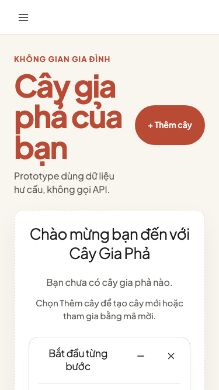
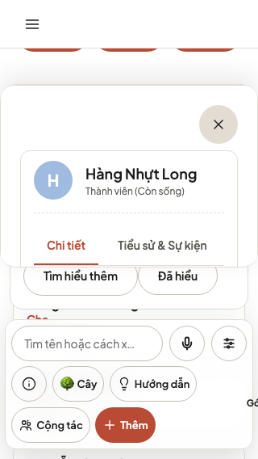
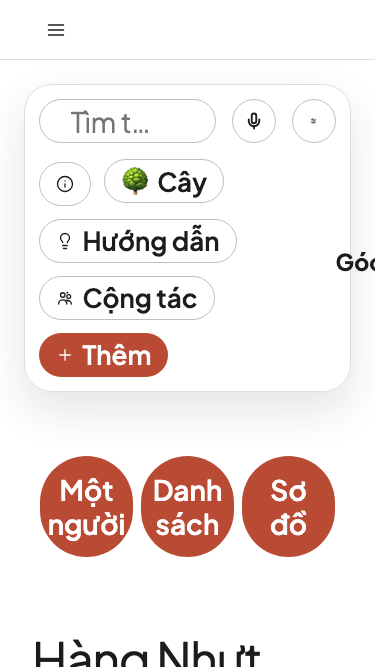
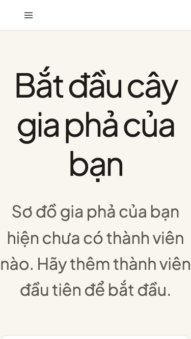
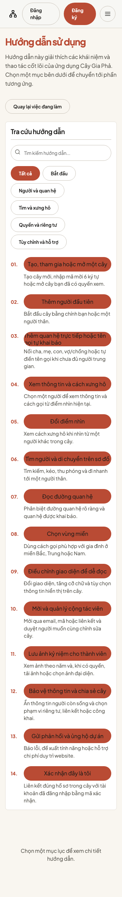

# Baseline audit — UX mobile cho người lớn tuổi

**Ngày audit:** 2026-07-13
**Phạm vi:** `/prototype/tree-list`, `/prototype/tree`, `/prototype/tree/empty`, `/prototype/help`
**Mục tiêu:** tìm các trở ngại khiến người lớn tuổi hoặc người ít tự tin công nghệ không biết bắt đầu,
không hiểu trạng thái hiện tại hoặc lo bấm sai trên mobile.

## Kết luận

Nền tảng responsive và accessibility kỹ thuật đang tốt hơn cảm nhận ban đầu: 48/48 smoke capture
ở desktop/tablet/mobile không có page-level overflow; các core control trên tree list và populated
tree đạt hit-area tối thiểu 44 CSS px trong phép đo hiện tại; dark mode và reduced motion render được.

Tuy nhiên, bốn route chưa vượt design gate. Vấn đề chính là **cạnh tranh không gian và thứ tự ưu
tiên**, không phải thiếu component:

1. Guidance xuất hiện trước nội dung chính và che phần lớn màn hình ở tree list/tree workspace.
2. Tree workspace mobile giấu nhãn của Help, legend, collaboration và Add thành icon; người mới phải
   đoán ý nghĩa trong khi graph, guidance và person panel cùng cạnh tranh một viewport.
3. 200% text làm các workspace fixed-height mất nội dung; Help phát sinh horizontal overflow và dài
   hơn 54.000 px.
4. Help có đủ nội dung canonical nhưng là một tài liệu tuần tự 13 mục, không có tìm kiếm hay nhóm theo
   tác vụ, nên khó dùng như trợ giúp đúng lúc.

## Các bước đã audit

### 1. Danh sách cây trống — cần đơn giản hóa

- **Điểm tốt:** CTA `+ Thêm cây` nhìn thấy, nội dung dùng từ ngữ đời thường, không gọi API thật.
- **UX risk:** checklist chiếm gần nửa viewport trước khi người dùng thấy page title và CTA. Welcome
  modal ban đầu còn thêm một lớp nội dung dài trước tác vụ đầu tiên.
- **Accessibility risk:** tại 200%, `main` cao 2.906 px nhưng document vẫn bị khóa ở 667 px; nội dung
  phía dưới không được phản ánh trong vùng cuộn của tài liệu.
- **Hướng xử lý:** empty state là task entry duy nhất; guidance chuyển thành một dòng/CTA có thể mở
  lại. Welcome copy rút ngắn và không lặp lại nội dung Help.

### 2. Tìm người và xem xưng hô — không đạt trên mobile

- **Điểm tốt:** graph có zoom/reset controls, search, viewpoint và person details; edge vẫn phân biệt
  được bằng line style.
- **UX risk:** ở 320 px, guidance đè lên graph và nằm sát dãy zoom; bottom toolbar có nhiều icon không
  nhãn. Người dùng phải hiểu đồng thời graph, overlay, selected person và viewpoint.
- **UX risk:** person panel khi mở gần như thay thế toàn bộ graph, nhưng không nói rõ đây là panel của
  ai theo một context header ổn định.
- **Accessibility risk:** ở 200%, guidance bị cắt, tên người chiếm nhiều dòng và các action bên dưới
  không còn trong viewport 375×667.
- **Hướng xử lý:** thử ba mô hình person-centric, list-first và accessible graph-first; mọi mô hình
  phải có nhãn cho core action và đường tap/list/search không phụ thuộc gesture.

### 3. Thêm người đầu tiên — task rõ nhưng mất chức năng ở 200%

- **Điểm tốt:** heading, mô tả và mục tiêu `Thêm người đầu tiên` rõ; form đã có progressive guidance.
- **UX risk:** guidance card và form cùng truyền đạt cách làm, tạo lặp nội dung trước khi nhập.
- **Accessibility risk:** workspace giữ document ở 375×667 khi text scale 200%; ảnh chỉ còn heading
  và mô tả, phần CTA/form nằm ngoài vùng tài liệu có thể chụp/đọc. Link `Chính sách quyền riêng tư`
  đo được thấp hơn 44 px ở mobile 375/430.
- **Hướng xử lý:** bỏ overlay khỏi empty state; để form tự hướng dẫn theo từng section, giữ draft khi
  Back/error và bảo đảm toàn bộ flow cuộn dọc ở 200%.

### 4. Help — nội dung đầy đủ nhưng không phù hợp tra cứu mobile

- **Điểm tốt:** đủ topic Requirement 17, heading semantic, có `Quay lại việc đang làm`, nội dung tải
  đồng bộ và không phụ thuộc API.
- **UX risk:** 13 topic được trình bày thành một trang tuyến tính rất dài; mục lục và phần nội dung lặp
  lại toàn bộ khối thông tin. Không có search, category hoặc current-section feedback.
- **Accessibility risk:** brand link `Cây Gia Phả` đo được 40×24 px. Ở 200%, document rộng 571 px so
  với viewport 375 px và cao 54.943 px, vi phạm mục tiêu reflow/zoom usable.
- **Hướng xử lý:** giữ `HELP_TOPICS` canonical nhưng thêm category/search, mở một topic tại một thời
  điểm và cung cấp excerpt ngay trong flow.

## Số đo và bằng chứng

- `npm test`: **100 test files, 426 tests passed** trước audit.
- Broad prototype matrix: **48/48 passed** tại 1280×800, 768×1024 và 375×667.
- Targeted matrix: **28/28 passed** tại 320×568, 375×667, 430×932, 768×1024,
  1280×800; thêm 200% text và dark/reduced-motion trên mobile.
- Không có horizontal overflow ở 100% text trên 4 route và 5 viewport.
- Core tree controls đạt hit-area floor trong phép đo visible target. Các ngoại lệ cần sửa: Help
  brand link và privacy inline link; tablet checkbox label cần đo lại bằng pointer hit-testing.
- Dữ liệu thô: [measurements.json](measurements.json) và
  [reflow-measurements.json](reflow-measurements.json).

## Evidence limits

- Screenshot và DOM bounds không chứng minh usability hoặc WCAG conformance đầy đủ.
- Chưa kiểm thử screen reader, switch control, browser zoom độc lập với app text setting hoặc thiết bị
  iOS/Android thật.
- Chưa có kết quả từ người dùng 60+; không được coi các hướng thiết kế đề xuất là direction thắng.
- Prototype dùng dữ liệu hư cấu và không đo latency/mutation failure của production API.

## Gate tiếp theo

Ba visual direction phải được đánh giá bằng
[protocol vòng 1](round-1-usability-protocol.md). Chưa sửa production UI trước khi direction được
chọn và prototype vòng 2 vượt các threshold đã khóa trong plan.
